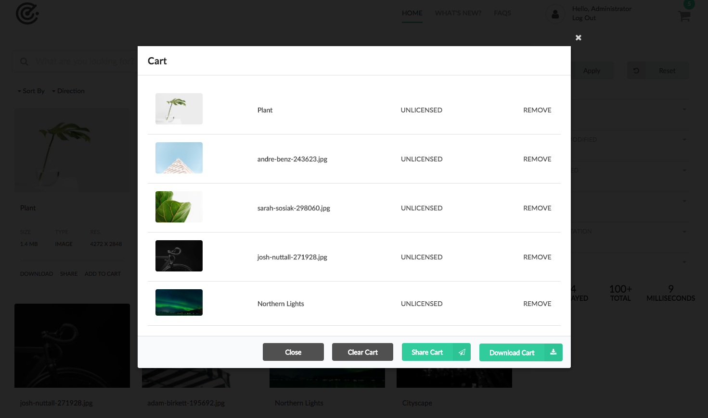
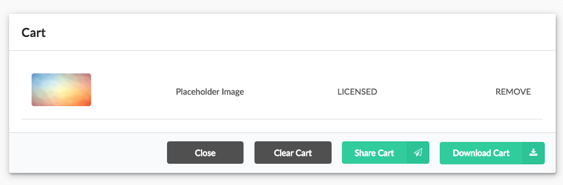
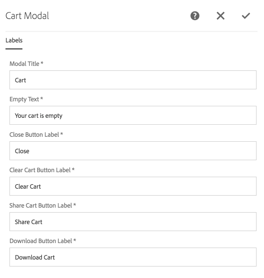

Displays the modal used to display the assets in the users' cart. From the cart the user can:

* Open the [Asset Details](../details.html) for an individual asset by clicking on the asset's title.
* Remove individual assets from the cart using the *Remove* button.
* Clear the cart, removing all items from the cart.
* Share the cart, which opens the [Share modal](../share/).
* Download the cart, which opens the [Download modal](../download/).
* Closing the cart dismisses the cart modal, but does not effect the contents of the cart.  

The "licensing" status only displays if "Licensing" is enabled on Asset Share Commons via the [Search page's Page Properties](../search/#page-properties).

## Authoring

The Cart Modal is authored by opening up the cart action page (of Action Template type) via AEM's Site admin. 

*Each cart page should have exactly one Cart Modal component.*

This Cart Modal action page must referenced from the [Search page's Page Properties](../search/#page-properties). 

The modal displays the placeholder image when being authored.

### Dialog

#### Modal Title

The modal's title.

#### Empty Text

Text to display when no assets are in the cart.

#### Close Button Label

The text for the button that closes the modal.

#### Clear Cart Button Label

The text for the button that removes all items from the cart.

#### Share Cart Button Label

The text for the button that shares the assets in the cart with others.

#### Download Button Label

The text for the button that lets users download all assets in the cart.

## Technical details

* **Component**: `/apps/asset-share-commons/components/modals/cart`
* **Sling Model**: `N/A`

#### ContextHub

The Cart in Asset Share Commons runs on a custom ContextHub store (`/apps/asset-share-commons/clientlibs/clientlib-contexthub/cart`).

In order for the cart to function correctly this cart must be loaded via the page hierarchy. 
A simple ContextHub configuration exposing this store is provided at `/etc/cloudsettings/asset-share-commons/contexthub`,
and can be set on the [Search page's Page Properties' Personalization tab](../search/#page-properties).

 

