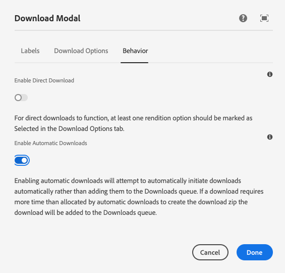

> For Asset Share Commons 1.x see [Download Modal](./1-x/)
>
> The Download Modal action has change significantly in Asset Share Commons 2.x.

Displays the modal used to download one or more assets.

* The left portion of the modal displays the list (one or more) assets that will be downloaded as part of this operation.
  * Multiple assets can be downloaded via the [Cart](../cart/). 

* The right portion of the modal displays a list of [Asset Renditions](../../development/asset-renditions) to download.
  * These options are defined and organized in the component's dialog.

Note that due to AEM's flexibility in generating different renditions for assets by type and as well as folder, not all renditions presented in this dialog may be available for the selected asset (this problem becomes more difficult when multiple assets are being downloaded that may not have the same renditions). In the event a rendition is selected the asset does not have, that rendition will be skipped.

The resulting download is a zip file (the zip file name can be authored via the dialog).

## Authoring

The Download Modal is authored by opening up the download action page (of Action Template type) via AEM's Site admin. 

*Each download page should have exactly one Download Modal component.*

This Download Modal action page must referenced from the [Search page's Page Properties](../search/#page-properties). 

The modal displays the placeholder image when being authored.

### Dialog / Labels

#### Modal Title

The modal's title.

#### Asset List Title

The title text to display above the list of assets to download.

#### Download Form Title

The title text to display above the download option check-boxes.

#### Cancel Button Label

The text for the button that closes the modal.

#### Download Button Label

The text for the button that lets users download the assets.

### Dialog / Download Options (since v2.0.0)

#### Downloadable Renditions Groups 

This defines the list of asset renditions available on the Downloads modal.

#### Rendition Group Label
 
The name of the group of renditions defined below it.

#### Renditions > Selected 

Marks this rendition as selected (checked) by default. Note, this is *very* important when using [Direct Downloads](#enable-direct-downloads) as the selected rendition names are what are "directly downloaded".

#### Renditions > Rendition Label 

The human-friendly name presented to the user as the download option.

#### Renditions > Rendition 

The actual rendition to download when this rendition option is selected. This is a list of the available named renditions registered with your Asset Share Commons 2.x implementation. 

You can [register custom asset renditions via OSGi configuration](../../development/asset-renditions).

#### Select All Label

The text to use to auto-generate "Select All" options per Rendition Group. If this value is not blank and a Rendition Group has more than 1 rendition option, a "Select All" checkbox will display at the top of the list using this label.

#### Archive Name Expression

The expression that defines the name of the download zip archive containing the asset renditions. This is an expression that can use the following placeholder "variables" to dynamically create the download file name.

* `${asset.count}`: Number of assets selected as part of this download.
* `${rendition.count}`: Number of renditions selected as part of this download.
* `${file.count}`: Number of assets X number of renditions. This is not always accurate as not all assets may be able to provide all renditions.
* `${year}`: The current year
* `${month}`: The current month (1-12)
* `${month.name}`: The current month's name (ex. Jan)
* `${day}`: The current day (1-31)
* `${day.name}`: The current day's name (ex. Mon)
* `${hour.12}`: The current hour (12 hour clock)
* `${hour.24}`: The current hour (24 hour clock)
* `${minute}`: The current minute
* `${am.pm}`: The current time's AM or PM designation

### Dialog / Behavior

#### Enable Direct Downloads

> AEM as a Cloud Service only

When Direct Downloads are enabled, the Download Modal will not display - rather, the download will start automatically based on the selected renditions (those marked as "Selected" in the Download Options tab).

This option should be used when users should not have the ability to select what renditions they want, rather this list is dictated by the dialog author.

#### Enable Automatic Downloads

> AEM as a Cloud Service only

When Automatic Downloads are enabled, Asset Share Commons will automatically attempt to start the download if it is ready within a few seconds of the download request. If the download is not ready after a few seconds, the download will be added to the Downloads list, available via the [Downloads modal](../downloads).

## Technical details

* **Component**: `/apps/asset-share-commons/components/modals/downloads`
* **Sling Model**: `com.adobe.aem.commons.assetshare.components.actions.downloads.impl.DownloadsImpl`

On AEM as a Cloud Service, this feature leverages AEM's Async Download Framework which is responsible for zipping up assets and their renditions.

On AEM 6.5.7+ a custom Async Download Framework used as AEM's Async Download Framework is only available on AEM as a Cloud Service.

The available renditions should be customized by your development team using [Asset Renditions](../../development/asset-renditions) OSGi configurations.
