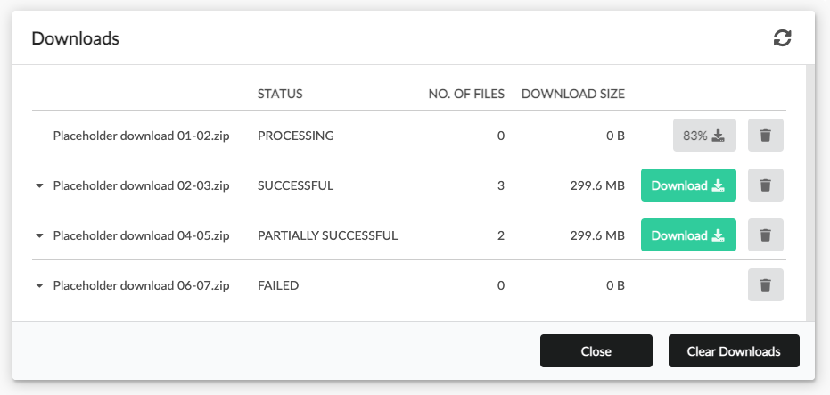
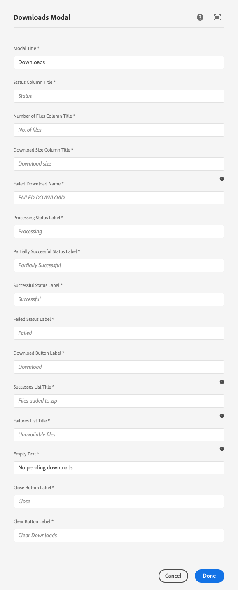

Displays the modal used manage the asynchronous downloads queue used by AEM as a Cloud Service to create and service download zips.

* Each row displays a download request to AEM, with the following columns:
    * First column displays the (configurable) name of the archive to download.
    * Status column displays the status of the download:
        * Processing: AEM is still working on creating the zip archive to download.
        * Successful: the archive contains all available asset/renditions AEM could provide
        * Partially successful: the archive  contains all at least one asset/renditions request - any failures are listed
        * Failed: No request assets/rendition combinations could be collected by AEM to add to the zip
* Tapping on a row displays a list of files in the zip archive as well as any files that could not be added to the zip archive for any reason
* Any download entries can be removed by tapping the Trash button in the row
* Successful and Partially successful downloads can be downloaded by tapping the Download button in the row

Note that download entries automatically expire and are removed after a few hours from this list, as AEM performs internal clean-up of the zip archives.

## Authoring

The Downloads Modal is authored by opening up the download action page (of Action Template type) via AEM's Site admin. 

*Each download page should have exactly one Download Modal component.*

This Download Modal action page must referenced from the [Search page's Page Properties](../search/#page-properties). 

The modal displays the placeholder image when being authored.

### Dialog / Labels

#### Modal Title

The modal's title.

#### Status Column Title

The title text to display for the status column.

#### Number of Files Column Title

The title text to display for the number of files in the zip column.

#### Download Size Column Title

The title text to display for the download zip column.

#### Failed Download Name

The download name to display in the event AEM cannot create the download archive and no name for that archive can be provided. This is an exceptional case.

#### Processing Status Label

The text to display when a download's status is "Processing".

#### Partially Successful Status Label

The text to display when a download's status is "Partially Successful".

#### Successful Status Label

The text to display when a download's status is "Successful".

#### Failed Status Label

The text to display when a download's status is "Failed".

#### Download Button Label

The text to display in the download button.

#### Successes List Title

The text to display for the successes list title.

#### Failures List Title

The text to display for the failures list title.

#### Close Button Label

The text to display in the close button.

#### Clear Button Label

The text to display in the clear downloads button.

## Technical details

* **Component**: `/apps/asset-share-commons/components/modals/downloads`
* **Sling Model**: `com.adobe.aem.commons.assetshare.components.actions.downloads.impl.DownloadsImpl`
