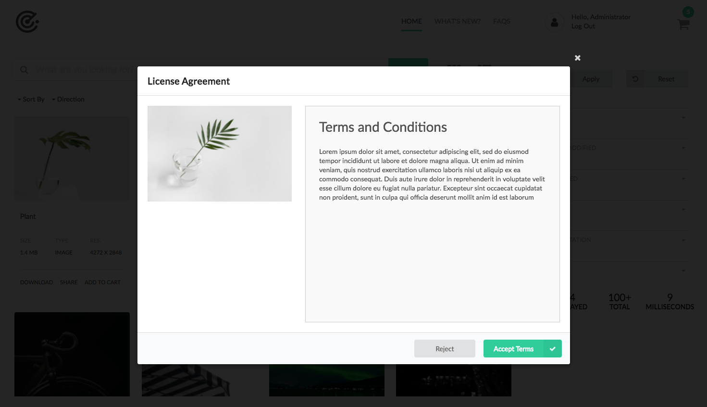
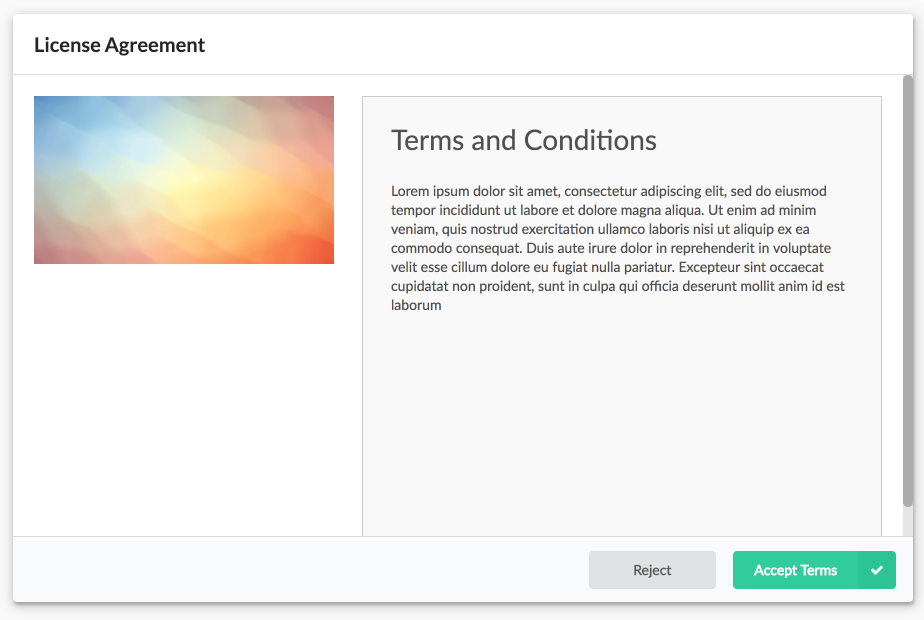
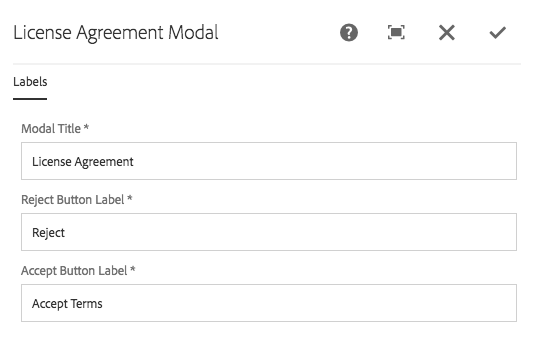

Displays the modal used to prompt users to access the asset's license agreement.

* The left portion of the modal displays the asset's thumbnail.
* The right portion of the modal displays the license agreement.

The License modal is displayed when
* Licensing is enabled for the asset share via the [Search page's Page Properties](../search/#page-properties)
* And a licensed asset is requested to be downloaded.
* Or a licensed asset is requested to be added to the cart.

Only if the license is accepted, does the initiating activity (download or add to cart) continue. 

### License selection

The license text displayed by displaying the web page pointed to via the asset's `xmpRights:WebStatement` metadata property.

In effect, each asset defines its own discrete license.

## Authoring

The modal is authored by opening up the license action page (of Action Template type) via AEM's Site admin. 

*Each license page should have exactly one License Modal component.*

This modal action page must referenced from the [Search page's Page Properties](../search/#page-properties). 

The modal displays the placeholder image when being authored.

### Dialog / Labels

#### Modal Title

The modal's title.

#### Cancel Button Label

The text for the button that rejects and closes the modal.

#### Download Button Label

The text for the button that accepts the license agreement.

## Technical details

* **Component**: `/apps/asset-share-commons/components/modals/license`
* **Sling Model**: `N/A`

An asset is determined to be licensed as it has a non-blank value in `[dam:Asset]/jcr:content/metadata@xmpRights:WebStatement`.

This value must resolve to a resource in AEM if it starts with a `/`, indicating and absolute path.
If the property value does not start with a `/` then it is assumed to be a valid external URL.

The property value of the `xmpRights:WebStatement` is then requested via an iframe in the License Modal for display to users.