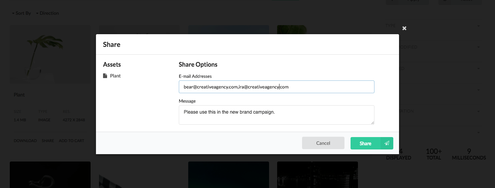
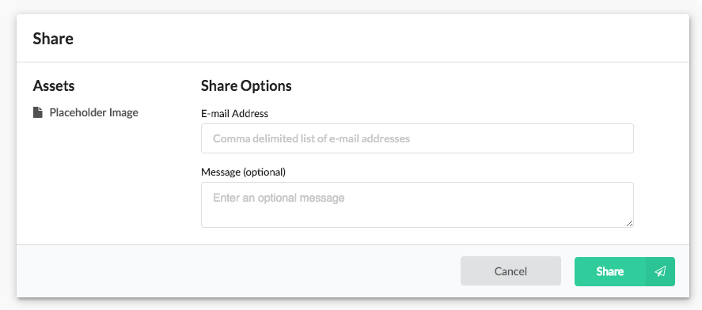
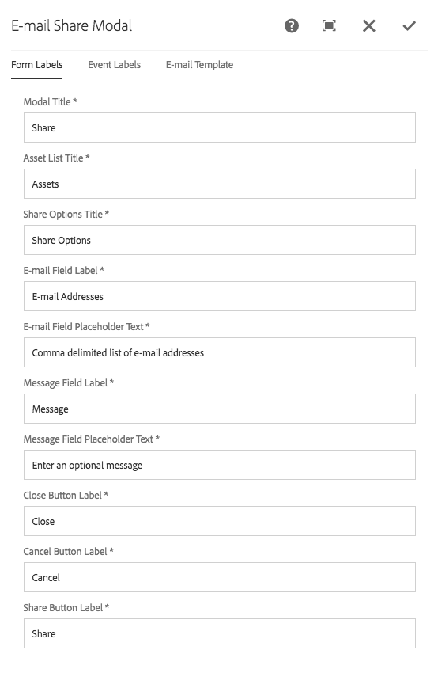
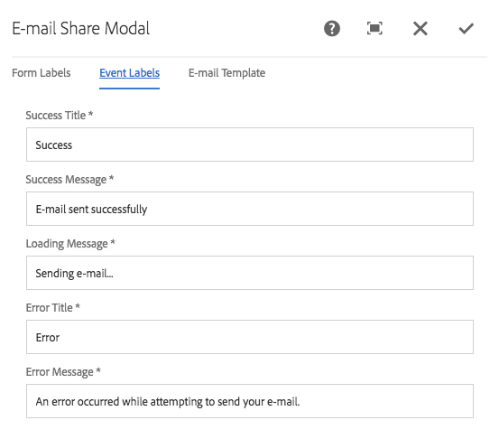
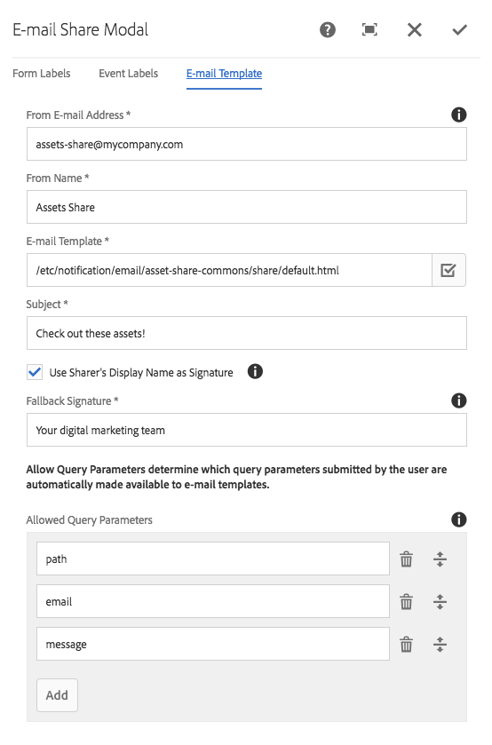

Displays the modal used to share links to assets to other users.

* The left portion of the modal lists the assets to share.
* The right portion is a form that allows the user to provide:
  * A comma-delimited list of e-mails to share these assets with.
  * A message field allowing the sharer to enter a customized message for the share recipients.

The sharing implmented in Asset Share Commons 1.0.0 uses e-mail and depends on ACS AEM Commons 3.11.0.

## Authoring

The modal is authored by opening up the license action page (of Action Template type) via AEM's Site admin. 

*Each license page should have exactly one License Modal component.*

This modal action page must referenced from the [Search page's Page Properties](../search/#page-properties). 



The modal displays the placeholder image when being authored.

### Dialog / Forms Labels 



#### Modal Title

The modal's title.

#### Asset List Title

The text to display about the list of assets to share. 

#### Share Options Title

The text to display about the e-mail and customized message input fields.

#### E-mail Field Label

The e-mail address field label.

#### E-mail Field Placeholder Text

The placeholder text for the e-mail address field. 

#### Message Field Label

The message textarea label.

#### Message Field Placeholder Text

The placeholder text for the message textarea.

#### Close Button Label

The text for the button that closes the modal.

#### Share Button Label

The text for the button that submits the share request.

### Dialog / Event Labels 



#### Sending Message

The message to display while the e-mail is being sent. 

#### Success Title

The title to display when the e-mail is successfully sent.

#### Success Message

The message to display when the e-mail is successfully sent.

#### Error Title

The title to display when an error prevents the e-mail from being successfully sent.

#### Error Message

The message to display when an error prevents the e-mail from being successfully sent.


### Dialog / E-mail Template 



#### From E-mail Address

The e-mail address from which the share e-mail is to be sent. 

 * The outgoing mail server (SMTP) MUST be configured to allow AEM to specify this e-mail address. If not, then the default from address configured in the Day CQ Mail Service's OSGi configuration will be used.

#### From E-mail Name

The friendly name to displaying in the recipient's e-mail client indicating the sender.

#### E-mail Template

The absolute path in AEM to the e-mail template to use. 

  * See technical details below for how to set-up an e-mail template with variables.
  * The sample e-mail template is located at: `/etc/notification/email/asset-share-commons/share/default.html`

#### Subject

The share e-mail's subject line.

#### Use Sharer's Display Name as Signature

Select to pass in the sharer's AEM display name to the e-mail template. 

The sending user's display name will be used, unless:

  * The sending user is "anonymous" or "admin".
  * The sending user's display name is blank.

In the event of the above two case, the signature defined below will be used.
 
#### Signature

The signature to use in the e-mails. 

*See **Use Sharer's Display Name as Signature** above for details*

#### Allowed Query Parameters
 
Allowed query parameters define which HTTP query parameters provided via the Search Options form are allowed to be made available in the e-mail template.

This list is used to prevent HTTP query parameters from overriding or injecting themselves as into the e-mail template.

These typically only need to be changed if the component itself changes. Consult your development team.

Default values are:

  * `path`
  * `email`
  * `message`
 
## Technical details

* **Component**: `/apps/asset-share-commons/components/modals/license`
* **Sling Model**: `N/A`

An asset is determined to be licensed as it has a non-blank value in `[dam:Asset]/jcr:content/metadata@xmpRights:WebStatement`.

This value must resolve to a resource in AEM if it starts with a `/`, indicating and absolute path.
If the property value does not start with a `/` then it is assumed to be a valid external URL.

The property value of the `xmpRights:WebStatement` is then requested via an iframe in the License Modal for display to users.

### E-mail Template

The default e-mail is available at: 

    /etc/notification/email/asset-share-commons/share/default.html
    
Custom e-mail templates can be created using the E-mail template variables listed below.
    
#### E-mail Template variables

E-mail template variables are set-up to be passed through the components `data` node or HTTP query parameters. This allows new e-mail template variables to be introduced with ONLY modifying the Share Modal component and NOT modifying any Java code.

See the sections below for more details.

#### Authored variables

All authored variables via the dialog that are stored on the component's `data` node (`[cq:Page]/jcr:content/.../share/data`) are made available to e-mail templates.
 
  * The `from` is injected via the `Sender E-mail Address` and `Sender Name` fields authored in the dialog.
    * The authored Sender E-mail Address is still available via `${senderEmailAddress}`
    * The authored Sender Name is still available via `${senderName}`
  * The `subject`, authored in the dialog, is auto-injected and not needed in the e-mail template.
    * The authored Subject is still available via `${subject}`
  * `${signature}`
    *  If `Use Sharer's Display Name as Signature` is NOT selected (or the user is admin, anonymous or has a blank display name) the `Signature` authored field is exposed.
    
#### User provided variables

User submitted values (via HTTP query parameters) are automatically exposed to e-mail templates as long as they are added to the the **Dialog > E-mail Template tab > Allowed Query Parameters**.
  
  * `${message}`
    * The message provided by the user via the share form.
  * `${assetLinkListHtml}`
    * A generated list of shared assets with links to their respective asset details pages.
  * `${signature}`
    *  If `Use Sharer's Display Name as Signature` is selected, the logged in user's display name is exposed.


### SMTP Servers

To try out the share functionality, when no SMTP server is readily available, Google Gmail's SMTP server works.

1. Create a Gmail account (if you dont already have one)
2. Configure the []Day CQ Mail Service](https://docs.adobe.com/docs/en/aem/6-3/administer/communities/email.html) OSGi configuration using [Gmail's SMTP Server settings](https://support.google.com/a/answer/176600?hl=en).
    * Remember, this configuration must be active on all AEM instances that will be sending e-mail.
    * Some Corporate VPNs block access to Gmail's SMTP servers so it is best to verify it works on a public/unfettered internet connection.

Below is an example sling:OsgiConfig definition node defined for a ficticious Gmail e-mail account.

`/apps/my-asset-share/config/com.day.cq.mailer.DefaultMailService.xml`

````
<?xml version="1.0" encoding="UTF-8"?>
<jcr:root xmlns:sling="http://sling.apache.org/jcr/sling/1.0" xmlns:jcr="http://www.jcp.org/jcr/1.0" xmlns:nt="http://www.jcp.org/jcr/nt/1.0"
          jcr:primaryType="sling:OsgiConfig"
          debug.email="{Boolean}false"
          from.address="myemailaccount@gmail.com"
          smtp.host="smtp.gmail.com"
          smtp.password="password123"
          smtp.port="465"
          smtp.ssl="{Boolean}true"
          smtp.user="myemailaccount@gmail.com"/>
````