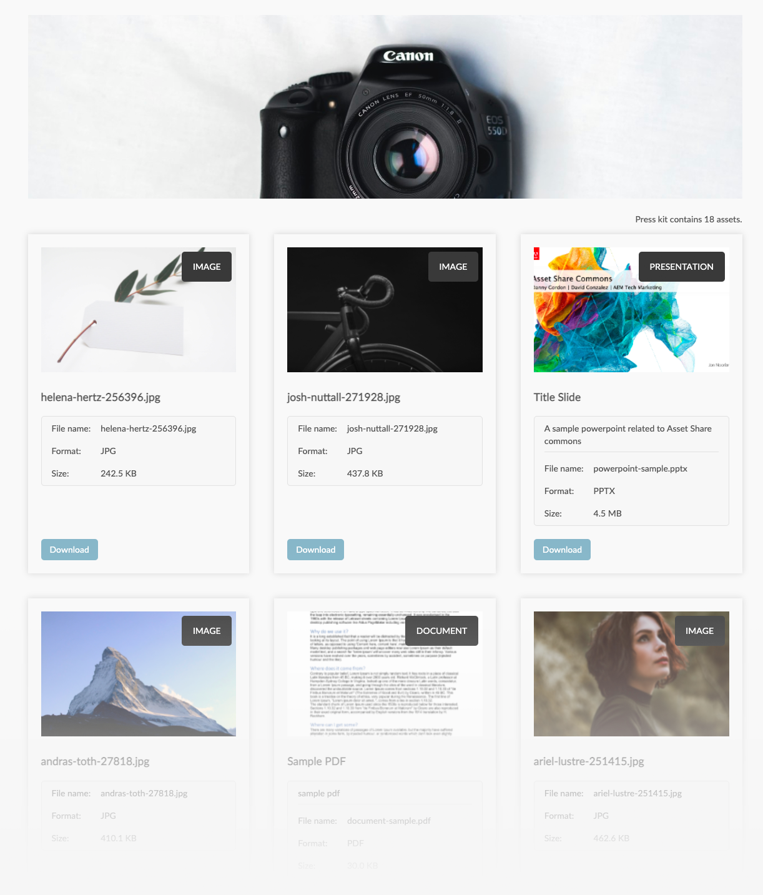

 
Asset Share Commons Asset kit  is a set of functionality that aids in the automated creation of "asset kit" pages. Asset kit pages are well-defined collections of assets that are displayed on a single, shareable web page. Examples of asset kits include "press kits" and "look books".

Asset kit comes with [workflows](../workflows/index.md) that help creator the asset kit pages form asset folders or collections, and replicating the pages to AEM Publish service.

## Overview video

<iframe title="Adobe Video Publishing Cloud Player" width="1000px" height="563px" style="margin: 1rem auto;" src="https://video.tv.adobe.com/v/3415467/?learn=on&quality=12" frameborder="0" webkitallowfullscreen mozallowfullscreen allowfullscreen scrolling="no"></iframe>

## Use

The expected use of the Asset kit is as follows:

1.  [AEM developer configures or extends](#developer) the asset kit functionality as required on AEM.
1.  AEM workflow administrator creates a AEM Workflow model with the [asset kit workflow steps](../workflows/index.md) and configures them accordingly.
1.  Author populates an AEM assets folder or collection (the payload) with the assets that are part of the asset kit.
1.  Author puts the payload under the AEM Workflow model (created in step 2).
    + Currently, the only OOTB way to do this is:
       + __Tools > Workflow > Models > select the Workflow Model > Start Workflow > specify the payload (asset folder or collection) path__
    + Custom development can add special __Create asset kit__ buttons to the AEM Author service interface that automatically start the workflow on asset folders or collections.
1.  Asset kit automatically creates (and optionally activates) the asset kit page
1.  The asset kit page URL cannot be shared with external users that require access to the kit's assets.

## Development

The following are the common configurations and extensions before using Asset Share Common's asset kit.

+   Create a custom Asset kit component that displays the kit's assets and the specific data they require. Custom asset kit components can implement custom HTL but use (directly or via delegating) the Asset Share Commons [AssetKit Sling Model](https://javadoc.io/static/com.adobe.aem.commons/assetshare.core/2.5.4/com/adobe/aem/commons/assetshare/components/assetkit/AssetKit.html).
+   Create an Asset kit page template
    + Populate the template's initial content with components the [Asset kit creator workflow step](../workflows/index.md#asset-kit-creator) updates based on the payload.
    + Populate the template's structure content with any component's that are common (and their content), across all asset kit pages.
    + Update the Page policy to include any custom CSS or JS client libraries required for the asset kit page to render to your brand standards, and function according to requirements.
+   Create [custom component updaters](../workflows/index.md#custom-component-updaters) to update the asset kit page, and any components (already in place via the template's initial content) with 
+   Optionally, create a [custom page path generator](../workflows/index.md/#custom-page-path-generators) if the asset kit page path should be something other than `yyyy/mm/uuid`.
