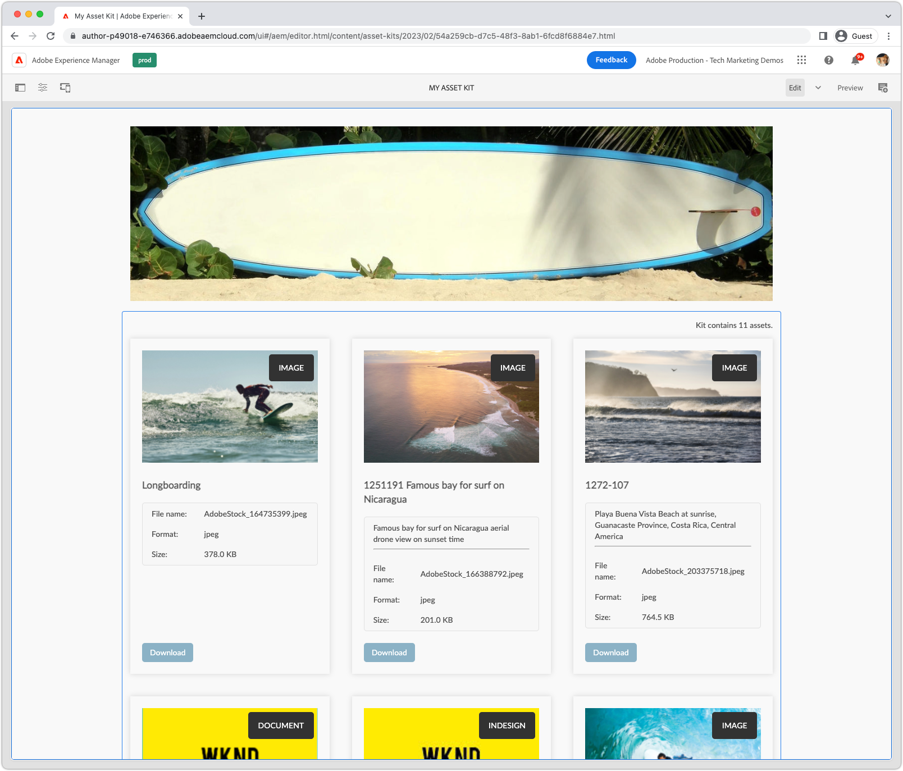
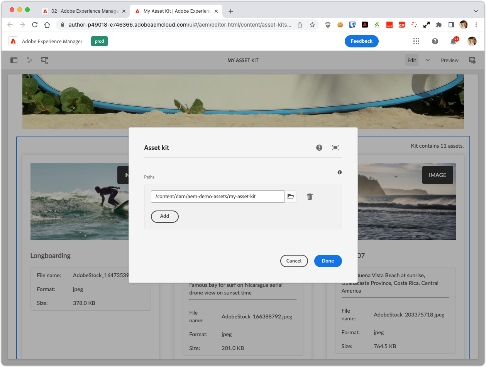

Asset kit pages are the result of the running the [Asset kit workflow steps](../workflows/index.md) against an AEM assets folder or collection.

The asset kit pages are shared via the AEM Publish service to specific audiences making it easy for them to quickly access only the assets they need.

The Asset kit pages can be configured and customized using traditional AEM Sites template/page/component development, as well light configuration of Asset Share Commons' Asset kit functionality.

## Editable templates

In order to create Asset kit pages, an editable page template must exist to create the pages from. This page template is specified in the [Asset kit creator workflow step](../workflows/index.md#asset-kit-page-template-path).

### Initial content

__Initial content__ on the editable template initializes the asset kit page with empty, or partially configured components. These components are then programmatically updated via [component updaters](#component-updaters);

### Structure

Editable template __structure__ defines and manages content that is shared across all asset kit pages.  

## Pages

Asset kit pages are created for each asset kit payload (assets folder or collection). The asset kit page can be configured in several ways:

+   It's structure and content via [initial](#initial-content) and [structural](#structure) content in the asset kit page template
+   It's location in AEM Site via the [Asset kit creator workflow step](../workflows/index.md#asset-kit-creator)
    + [Root page path location](../workflows/index.md#asset-kit-pages-root-path) directs the root location that all asset kit pages are created
    + A pluggable [page path generator](../workflows/index.md#page-path-generator) generates a unique page path based on the payload.

## Asset kit component



A custom Asset kit component can be developed that displays the kit's assets and the specific data they require. Custom asset kit components can implement custom HTL but use (directly or via delegating) the Asset Share Commons [AssetKit Sling Model](https://javadoc.io/static/com.adobe.aem.commons/assetshare.core/2.5.2/com/adobe/aem/commons/assetshare/components/assetkit/AssetKit.html).

This custom Asset kit component must be added to the asset kit's [editable template's initial content](#editable-templates) for the [component updater](#component-updaters) to update.

A common customization of the asset kit component is to use its Sling Model, but provide a custom HTL that renders the asset list based on specific requirements.

### Client library

The example Asset Kit component is styled by CSS/JS incorporated via either of the following Client Library categories:

+ `asset-share-commons.site.components.asset-kit`
+ `asset-share-commons.theme.light-ui`

## Component updaters

The provided [AssetKitComponentUpdaterImpl.java](https://github.com/adobe/asset-share-commons/blob/main/core/src/main/java/com/adobe/aem/commons/assetshare/util/assetkit/impl/componentupdaters/AssetKitComponentUpdaterImpl.java) selectable from the [Asset Kit creator](../workflows/index.md#asset-kit-creator) is used to update the Asset Kit component on the page.

### Configuration

The Asset Kit component updater can be configured to update a custom (or extended) Asset kit component via OSGi configuration: 

`ui.config/src/.../osgiconfig/config.author/com.adobe.aem.commons.assetshare.util.assetkit.impl.componentupdaters.AssetKitComponentUpdaterImpl.cfg.json`

```
{
    "resource.type": "example/components/custom-asset-kit"
    "asset.kit.path.property: "paths"
}
```

