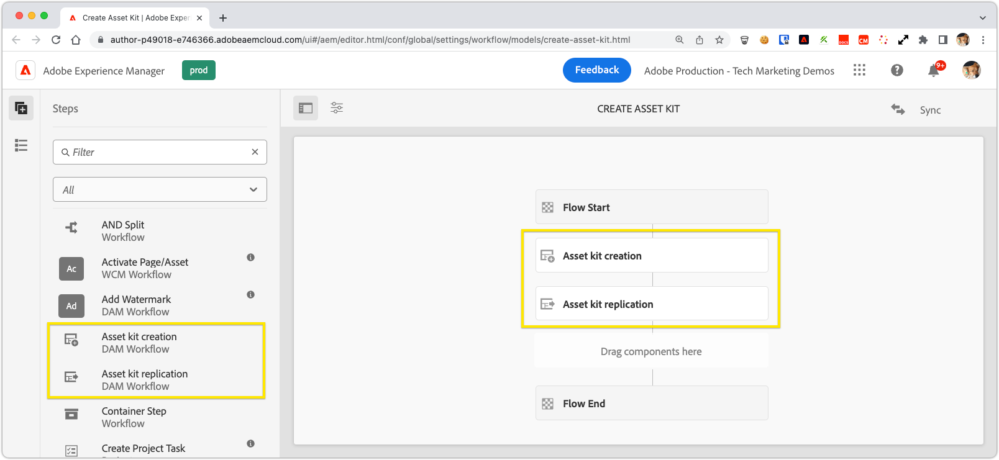
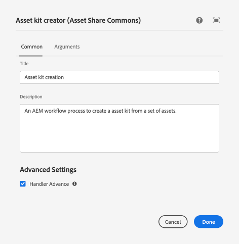
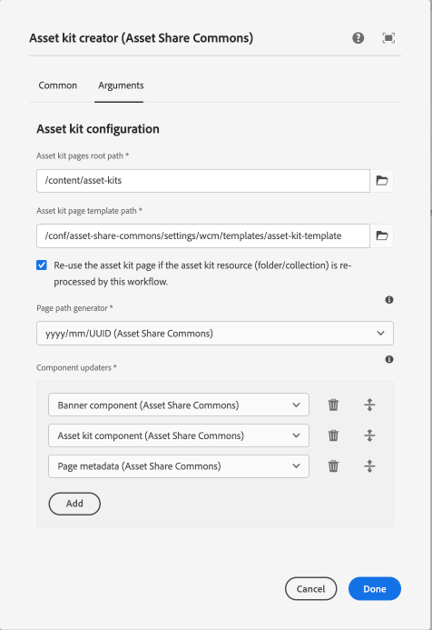
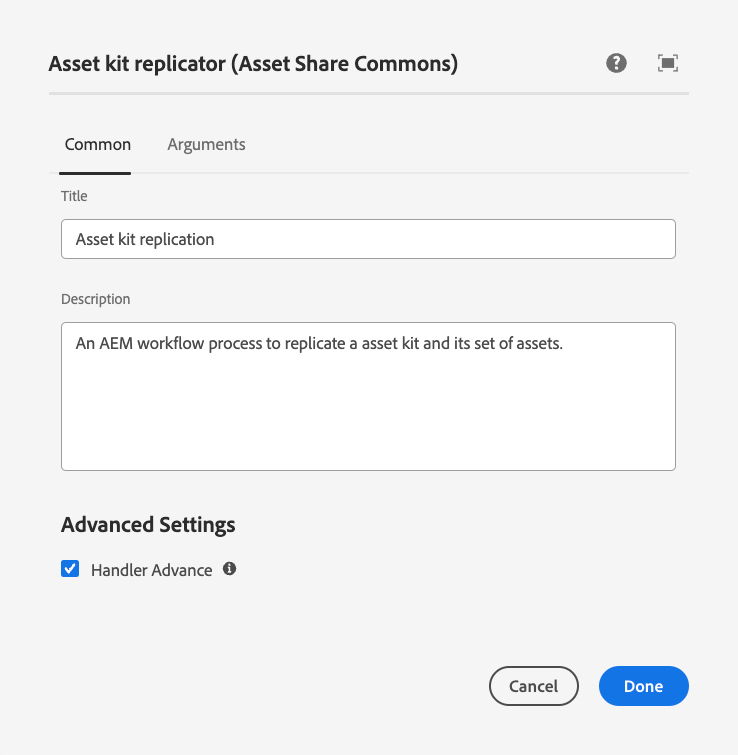
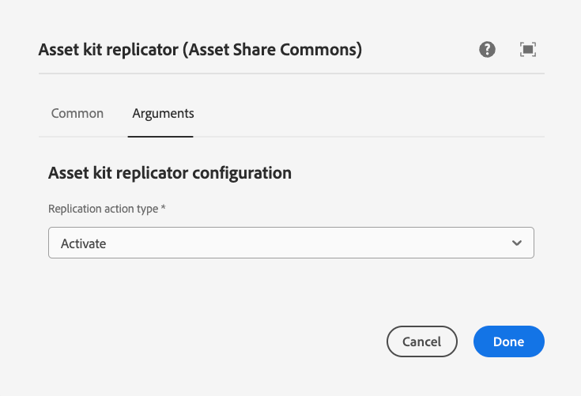

## Asset kit creator

The __Asset Kit creator__ workflow step is responsible for processing the Asset kit payload (an asset folder or collection) and creating an asset kit page from it.

### Common tab

The __Common__ tab manages default AEM Workflow step configurations.



#### Title

The display name of the workflow step in the workflow model. Value does not impact Asset kit creation.

#### Description

The description of the workflow step in the workflow model. Value does not impact Asset kit creation.

#### Handle Advance

Indicates if the workflow step should automatically advance to the next workflow step when complete. Leave this selected.

### Arguments tab

The __Arguments__ tab manages the asset kit creator-specific configurations.



#### Asset kit pages root path

The root path in AEM the Asset Kit pages created by this workflow step are created under. This must be a valid AEM Sites root. The root path is automatically created as Sling Ordered Folders when they do not exist.

#### Asset kit page template path

The AEM Sites page template to use when creating the asset kit pages. This template often contains initial content defining empty components that the workflow step updates via the [component updaters](#component-updaters) configured below.

#### Reuse the asset kit page

Checkbox that determines when the same asset kit payload (asset folder or collection) is reprocessed, if a new asset kit page is created, or its previous asset kit page is updated.

#### Page path generator

A pluggable](#custom-page-path-generators) generator that builds path to the asset kit page. This value is appended to the [asset kit pages root path](#asset-kit-pages-root-path).

__Asset Share Commons provided page path generators:__

+ __yyyy/mm/UID (Asset Share Commons)__ generates a path in format __YEAR__/__Month__/__Unique ID__. For example, an asset kit page created on September 16, 2022 would have a page path that resembles `.../2022/09/65fd7d38-a953-11ed-afa1-0242ac120002`.

[Custom page path generators](#custom-page-path-generators) can be developed to generate bespoke page path generation.


#### Component updaters

A [pluggable](#custom-page-path-generators) set of updaters that update the asset kit page and/or its components based on the workflows payload. This set of generators is what programmatically "authors" the asset kit pages to display the correct information. The 

__Asset Share Commons provided component updaters:__

+ __Page metadata (Asset Share Commons)__ updates the page's title and description with that of asset kit payload's. If an asset folder is the payload, the asset kit page's title is updated to the asset folder title, and asset kit page's description to the asset folder description. Similar behavior with asset collection as the payload.
+ __Banner component (Asset Share Commons)__ updates an "Asset share commons image component"(resource type of: `asset-share-commons/components/content/image`) on the page with an asset path. This expects the image component to be added to the [asset kit template's](#asset-kit-page-template-path) initial content. 
+ __Asset kit component (Asset Share Commons)__ updates the [Asset kit component](../pages/index.md#asset-kit-component) (resource type of: `asset-share-commons/components/asset-kit`) on the asset kit page with the path to the asset kit payload. This expects the [Asset kit component](../pages/index.md#asset-kit-component) to be added to the [asset kit template's](#asset-kit-page-template-path) initial content. 

[Custom component updaters](#custom-component-updaters) can be developed to update asset kit pages in a bespoke manner.

## Asset kit replicator

The __Asset Kit creator__ workflow step is responsible for replicating (either activating or deactivating) an asset kit. The workflow step replicates the asset kit page, and all references, including the assets it displays.

The use of this workflow step is optional, and/or other workflow steps, such as a review step, can be placed between the [Asset kit creator](#asset-kit-creator) step and this step.

### Common tab

The __Common__ tab manages default AEM Workflow step configurations.



#### Title

The display name of the workflow step in the workflow model. Value does not impact Asset kit creation.

#### Description

The description of the workflow step in the workflow model. Value does not impact Asset kit creation.

#### Handle Advance

Indicates if the workflow step should automatically advance to the next workflow step when complete. Leave this selected.

### Arguments tab

The __Arguments__ tab manages the asset kit creation-specific configurations.



#### Replication action type

The replication action type determines if the asset kit is activated or de-activated from the AEM Publish service.

__Options:__
 
+ __Activate__ activates the asset kit page, and all references to the AEM publish service.
+ __Deactivate__ de-activates the asset kit page, and all references from the AEM publish service.


## Technical details

The following technical details provide insights into how these workflows are implemented, and how they are extended.

+ [Asset kit creator workflow process implementation](https://github.com/adobe/asset-share-commons/blob/main/core/src/main/java/com/adobe/aem/commons/assetshare/workflow/assetkit/impl/AssetKitCreatorWorkflowProcess.java)
+ [Asset kit replicator workflow process implementation](https://github.com/adobe/asset-share-commons/blob/main/core/src/main/java/com/adobe/aem/commons/assetshare/workflow/assetkit/impl/AssetKitReplicationWorkflowProcess.java)

### Custom page path generators

Develop an OSGi component that implements the [PagePathGenerator interface](https://javadoc.io/static/com.adobe.aem.commons/assetshare.core/2.5.4/com/adobe/aem/commons/assetshare/util/assetkit/PagePathGenerator.html) to create a custom page path generator.

__Example page path generator implementations:__

+ [YyyyMmPagePathPathGeneratorImpl.java](https://github.com/adobe/asset-share-commons/blob/main/core/src/main/java/com/adobe/aem/commons/assetshare/util/assetkit/impl/pagegenerators/YyyyMmPagePathPathGeneratorImpl.java) 

### Custom component updaters

Develop an OSGi component that implements the [ComponentUpdater interface](https://javadoc.io/static/com.adobe.aem.commons/assetshare.core/2.5.4/com/adobe/aem/commons/assetshare/util/assetkit/ComponentUpdater.html) to create a custom component updater.

The [AssetKitHelper](https://javadoc.io/static/com.adobe.aem.commons/assetshare.core/2.5.4/com/adobe/aem/commons/assetshare/util/assetkit/AssetKitHelper.html) OSGi service is helpful when developing custom component updaters.

__Example component updater implementations:__

+ [PageMetadataComponentUpdaterImpl.java](https://github.com/adobe/asset-share-commons/blob/main/core/src/main/java/com/adobe/aem/commons/assetshare/util/assetkit/impl/componentupdaters/PageMetadataComponentUpdaterImpl.java)
+ [BannerComponentUpdaterImpl](https://github.com/adobe/asset-share-commons/blob/main/core/src/main/java/com/adobe/aem/commons/assetshare/util/assetkit/impl/componentupdaters/BannerComponentUpdaterImpl.java)
    + The component this implementation searches for to update can be configured via OSGi configuration:

    `ui.config/src/.../osgiconfig/config.author/com.adobe.aem.commons.assetshare.util.assetkit.impl.componentupdaters.BannerComponentUpdaterImpl.cfg.json`

    ```
    {
        "resource.type": "example/components/custom-banner",
        "banner.asset.path.property": "path"
    }
    ```

+ [AssetKitComponentUpdaterImpl.java](https://github.com/adobe/asset-share-commons/blob/main/core/src/main/java/com/adobe/aem/commons/assetshare/util/assetkit/impl/componentupdaters/AssetKitComponentUpdaterImpl.java)
    + The component this implementation searches for to update can be configured via OSGi configuration:

    `ui.config/src/.../osgiconfig/config.author/com.adobe.aem.commons.assetshare.util.assetkit.impl.componentupdaters.AssetKitComponentUpdaterImpl.cfg.json`

    ```
    {
        "resource.type": "example/components/custom-asset-kit"
    }
    ```
