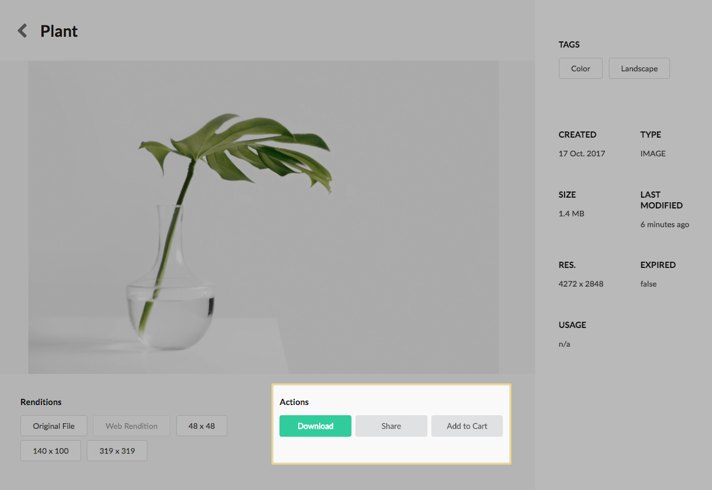
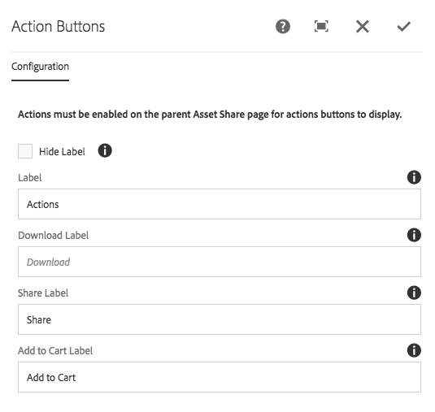

The Actions buttons display the actions that can be performed on the asset. Asset Share Commons 1.0.0 ships 3 actions:

* Download
* Share
* Add to Cart

All actions can be enabled/disabled via the Search Page's > Page Properties. If an action is disabled, the respective button will not display in this component.

## Authoring

Actions can be enabled/disabled via the Search Page's > Page Properties. If an action is disabled, the respective button will not display in this component.

Setting an action button label to be blank, hides the action button. At least 1 action button must be visible for the component to render.

### Dialog / Configuration

#### Hide Label

Select to hide the title for the action buttons.

#### Label

The title (or label) for the action buttons.

#### Download Label

The button label for the download action button.

  * If left blank, this button does not display.

#### Share Label

The button label for the share action button.

  * If left blank, this button does not display.

#### Add to Cart Label (v1.1.0)

The button label for the add to cart action button.

  * If left blank, the cart action button does not display.

#### Remove from Cart Label (v1.1.0)

The button label for the remove from cart action button.

  * If left blank, the cart action button does not display.

## Technical details

* **Component**: `/apps/asset-share-commons/components/details/action-buttons`
* **Sling Model**: `com.adobe.aem.commons.assetshare.components.details.impl.ActionButtonsImpl`
