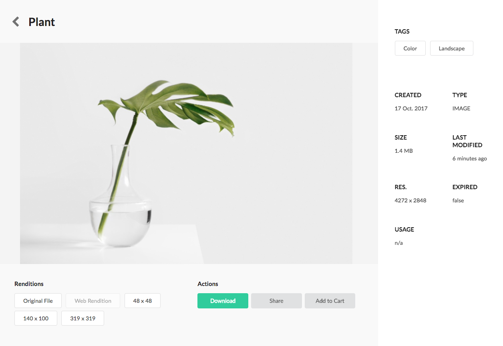
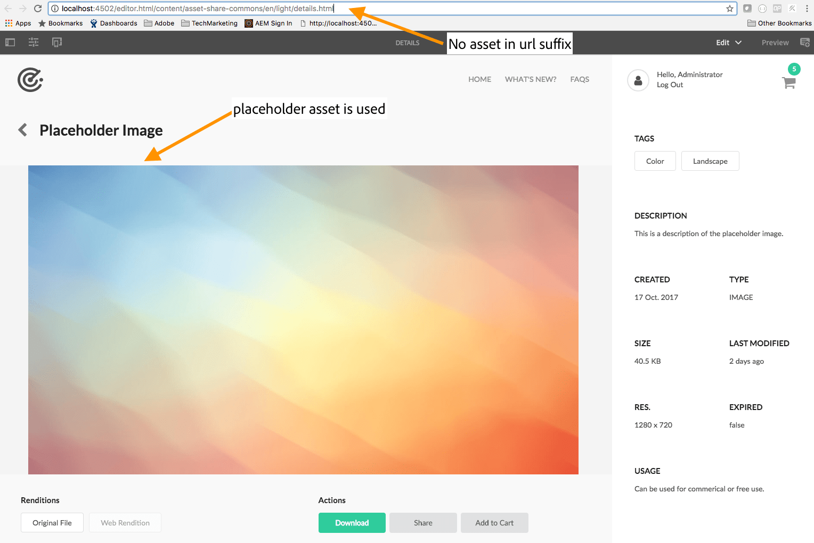
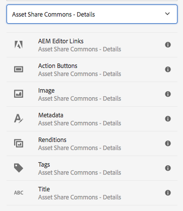

The Details Page is intended to display additional information for a given asset, including a preview image, metadata, and available renditions.  

The detail page is designed to render asset details based on a URL suffix. The suffix is expected to be an absolute path to a Dam Asset. `/content/<details-page-path>.html/<asset-path>` i.e *http://localhost:4502/content/asset-share-commons/en/light/details/image.html/content/dam/asset-share-commons/en/public/pictures/sarah-dorweiler-357959.jpg*. All of the Asset Details Components will render based on the asset found in the suffix. In this way only a single details page needs to be created to render multiple assets.

## Content Hierarchy

Detail pages are expected to be created beneath a [Search Page](../../search/). A "default" details page should be created that can handle all asset types. Additional detail pages can be created that are specific to various asset mime types. In this way authors have flexibility to configure metadata components based on the expected mime type. The configuration for link search results to the correct detail page is configured within the [Search Page](../../search.html). 

```
/content
     /<site-root>
           /<search-page>
                 /details (default details page)
                     /image (details for images)
                     /video (details for videos)
                     /docx  (details for word documents)
                     /ppt   (details for power point)
```

## Authoring

### Template


Create a page using the Asset Details Template or Asset Details Template Dark.

### Page Properties


Standard page properties are inherited from the [Page(v1) core component](https://github.com/Adobe-Marketing-Cloud/aem-core-wcm-components/tree/master/content/src/content/jcr_root/apps/core/wcm/components/page/v1/page). An additional tab for Asset Share is included.

#### Placeholder Asset Override



Many components on the Details Page depend on an valid asset in order to render properly. Built in to Asset Share Commons is the notion of a placeholder asset that will be used if no asset is found in the URL suffix. This behavior only occurs in the author environment. A default placeholder is a required property on the [Search Page](../../search.html). The override field allows an author to override this default placeholder per details page.

## Asset Details Components



* [Action Buttons](../action-buttons)
* [AEM Editor Links](../editor-links)
* [Image](../image)
* [Metadata](../metadata)
* [Renditions](../renditions)
* [Tags](../tags)
* [Title](../title)

## Technical details

* **Sling Resource Type**: `asset-share-commons/components/structure/details-page`
* **Template**: `/conf/asset-share-commons/settings/wcm/templates/details-template` or `/conf/asset-share-commons/settings/wcm/templates/details-template-dark`
