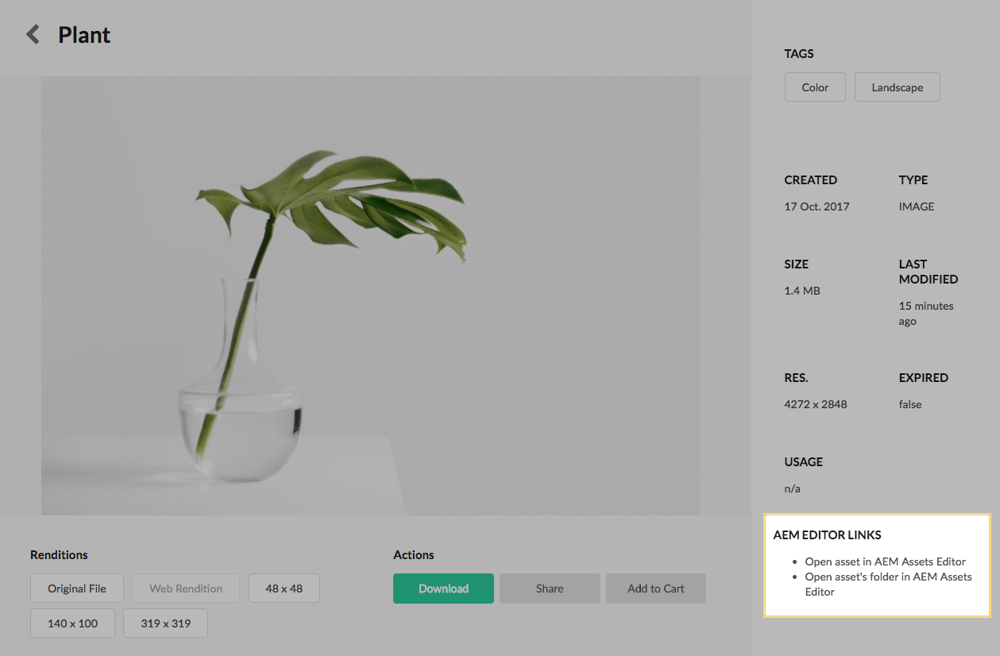
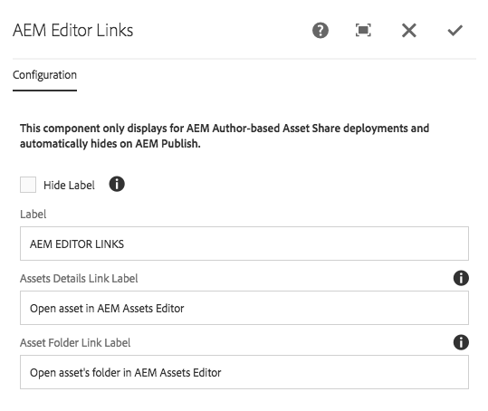

The AEM Editor Links component only displayed when rendered on AEM Author, and useful only when Asset Shares are used on AEM Author to help internal members of an organization locate assets.

This component display links that the current asset in the traditional AEM Assets authoring views:

* The AEM Assets asset details page 
* The AEM Assets folder that contains the current asset

_This component is intended to help AEM Authors configuring Asset Share to quickly access asset to clean and correct metadata._

## Authoring

Either **Asset Details Link Label** or **Asset Folder Link Label** MUST have values for this component to display.

### Dialog / Configuration

#### Hide Label

Select to hide the title for the links.

#### Label

The title (or label) for the links.

#### Asset Details Link Label

The text to display for the link that takes users to the AEM Assets's asset details view.

  * If left blank, this link does not display.

#### Asset Folder Link Label

The text to display for the link that takes users to the AEM Assets's folder view.

  * If left blank, this link does not display.

## Technical details

* **Component**: `/apps/asset-share-commons/components/details/editor-links`
* **Sling Model**: `com.adobe.aem.commons.assetshare.components.details.impl.EditorLinksImpl`

This component will only render if the `author` Sling run mode is present; this check is performed in `EditorLinksImpl`.
