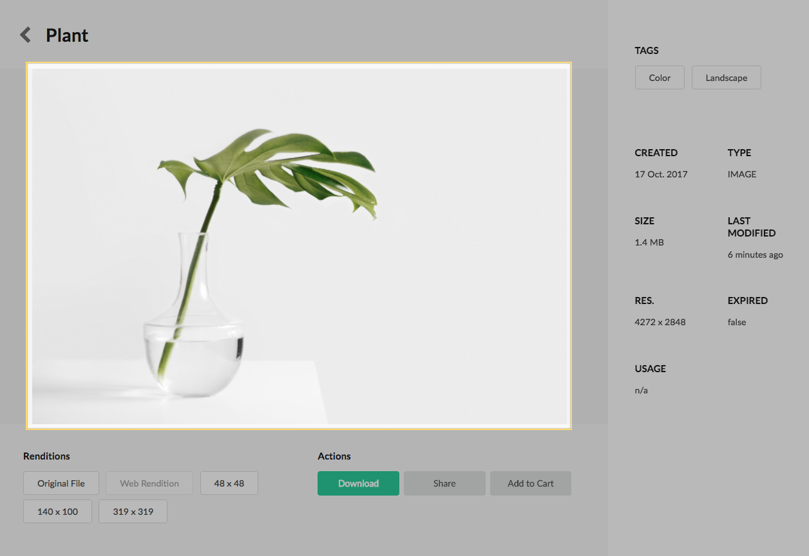
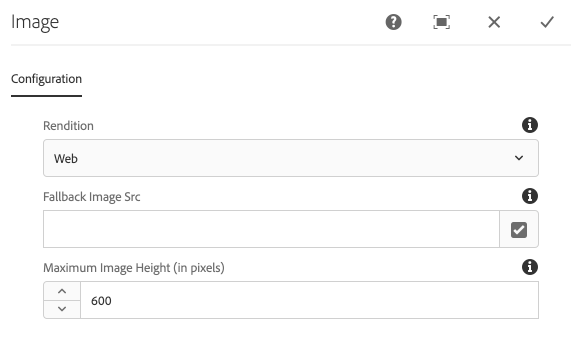

The Image component displays an image rendition for a given Asset.

## Authoring

Authors have several configurations available to choose which asset rendition is displayed.

### Dialog / Configuration

#### Rendition Type

Select the rendition to populate the image `src` attribute.

* **Web Rendition** - uses the [computed property](../computed-properties/) Web Rendition as the image src.
* **Thumbnail Rendition** - uses the [computed property](../computed-properties/) Thumbnail Rendition as the image src.
* **Asset Path** - uses [computed property](../computed-properties/) Asset Path as the image src.
* **Use 'Rendition File Name Regex' defined below** - if selected will use a regular expression defined in the next dialog field to determine the rendition to use.

#### Rendition File Name Regex

A regular expression that can be used to match a rendition to be used to display as the image src. Renditions are looked for beneath the `renditions` folder located beneath `<dam:asset>/jcr:content/renditions`.

#### Fallback Image Src

An image can be selected to be used if no rendition for a given asset is found. The fallback image src will be used directly to populate the `src` attribute. Even if the fallback image is an asset in the DAM that has a rendition, only the path will be used.

#### Maximum Image Height (in pixels)

If set, an inline style attribute `max-height` will be set to explicitly limit the heigh the image can grow. If left blank the image will render as is.

## Technical details

* **Component**: `/apps/asset-share-commons/components/details/image`
* **Sling Model**: `com.adobe.aem.commons.assetshare.components.details.impl.ImageImpl`

**Dialog Data Sources**

* **Rendition Type**: `com.adobe.aem.commons.assetshare.content.impl.datasources.ComputedPropertiesDataSource` with a filter for only computed properties for `renditions`.

This component allows authors to use [Computed Properties](../computed-properties.html).