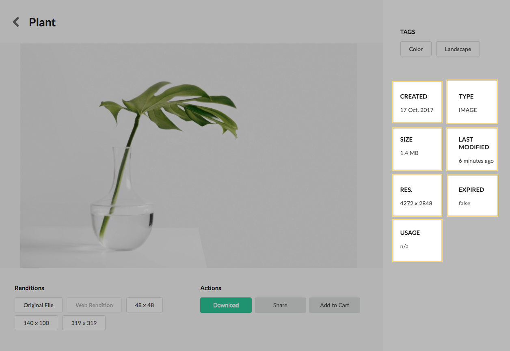
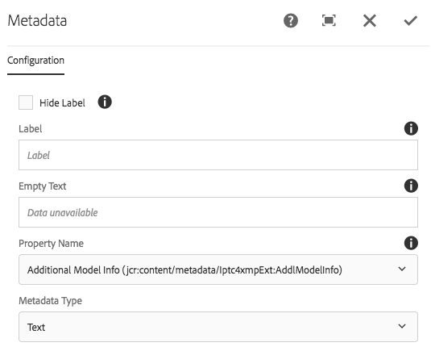
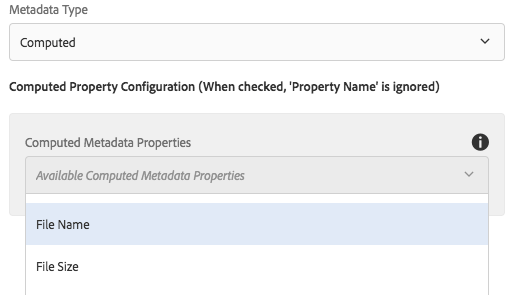
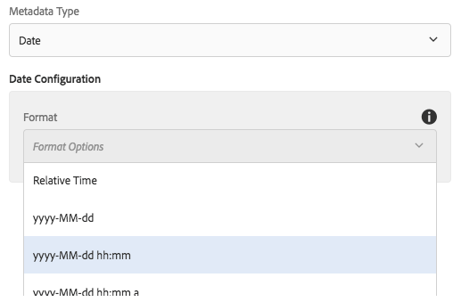
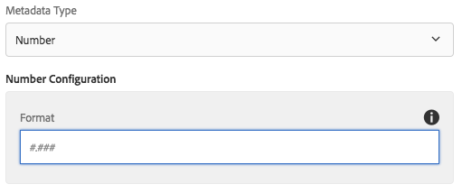
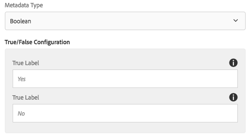
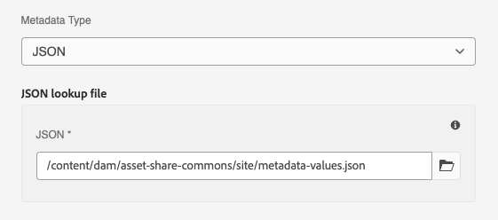

The Metadata component displays a single metdata property for a given asset. Metadata types of Text, Date, Number, and Boolean are supported along with an optional label to identify the property displayed. Computed properties are also supported.

## Authoring

### Dialog / Configuration



#### Hide Label

Select to hide the metadata label.

#### Label

Text to identify the property being displayed. Will be hidden if the Hide Label select box is selected.

#### Empty Text

(Optional) Text to render if the metadata property cannot be found on the current asset. If the Empty Text field is left empty **AND** the metadata property on the current asset is not found the entire component will be hidden.

#### Property Name

Specifies which metadata property of an asset to be displayed. The dropdown list is populated by all available properties defined in the Assets Metadata Schema ui. *Note this selection is ignored if a Computed Property Type is used.* 

#### Metadata Type

Specifies the type of metadata that is intended to be displayed. Several types are supported with various formatting options based on the type.

### Dialog / Configuration / Metadata Type: Computed



A computed property can be selected from the Computed Metadata Properties dropdown. If a computed property is used the Property Name selection is ignored. More information about available computed properties can be found [here](asset-share-commons/pages/development/computed-properties/).

### Dialog / Configuration / Metadata Type: Text

Displays the metadata property specified by the Property Name dropdown. No additional formating or evaluation is performed.

### Dialog / Configuration / Metadata Type: Date



Displays the metadata property specified by the Property Name as a date. If the Several date formats are available based on the [HTL spec](https://github.com/Adobe-Marketing-Cloud/htl-spec/blob/master/SPECIFICATION.md#1222-dates).

**HTL Date Formats**

*  yyyy-MM-dd
*  yyyy-MM-dd hh:mm
*  yyyy-MM-dd hh:mm a
*  EEE, d MMM y
*  dd MMM.y

**Relative Time**
 
 In addition to the HTL date formats, Relative Time displays the date in a relative format i.e *2 days ago*, *1 year ago*. 
 
 The relative time is calculated client side using [Moment.js](https://momentjs.com/) library. Since it is calculated client side there is no dispatcher cache considerations. Moment.js library is included via the vendor client library located at `/apps/asset-share-commons/clientlibs/vendor/moment`. 

### Dialog / Configuration / Metadata Type: Number



Displays a long, int or double property as a number. Optionally additional formatting can be specified to customize the rendered display. The available format is based on the [HTL spec](https://github.com/Adobe-Marketing-Cloud/htl-spec/blob/master/SPECIFICATION.md#1223-numbers).

### Dialog / Configuration / Metadata Type: Boolean



Displays a boolean metadata property. Author can specify the labels displayed if the property is true or if the property is false. By default *Yes* and *No* labels will be used for true and false values. 

### Dialog / Configuration / Metadata Type: Boolean


Displays a boolean metadata property. Author can specify the labels displayed if the property is true or if the property is false. By default *Yes* and *No* labels will be used for true and false values. 

### Dialog / Configuration / Metadata Type: JSON



Specifies a JSON file in the DAM that is used as a property value -> display value lookup table. 

For example, the following JSON file could be used to display friendly names based on the asset's `dc:format` property values.

The JSON file must be in the following format, where each option object comprising of a `text` field that contains the display text, and a `value` field containing the asset property value, used as the key to look up the `text`.

```json
{
  "options": [
    {
      "value": "image/jpeg",
      "text": "JPEG image"
    },
    {
      "value": "application/vnd.openxmlformats-officedocument.presentationml.presentation",
      "text": "Powerpoint presentation"
    }]
}
```

## Technical details

* **Component**: `/apps/asset-share-commons/components/details/metadata`
* **Sling Model**: `com.adobe.aem.commons.assetshare.components.details.impl.MetadataImpl`

**Dialog Data Sources**

* **Property Name**: `com.adobe.aem.commons.assetshare.content.impl.datasources.MetadataSchemaPropertiesDataSource`
* **Computed Property**: `com.adobe.aem.commons.assetshare.content.impl.datasources.ComputedPropertiesDataSource`

This component allows authors to insert [HTL formatting](https://github.com/Adobe-Marketing-Cloud/htl-spec/blob/master/SPECIFICATION.md#122-format) patterns directly. A malformed format can cause an exception and cause the component not to render properly. 

This component allows authors to use [Computed Properties](/asset-share-commons/pages/development/computed-properties/).
