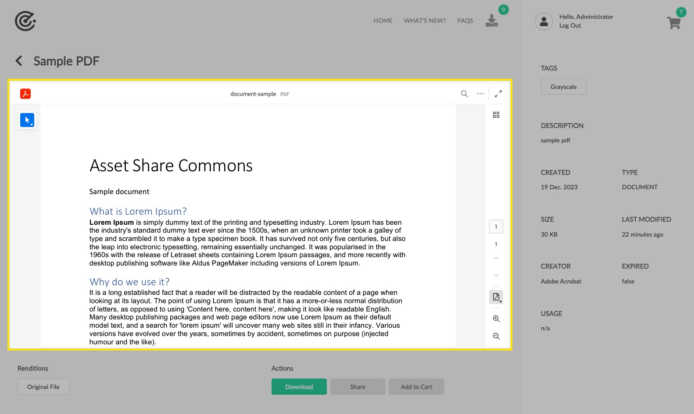
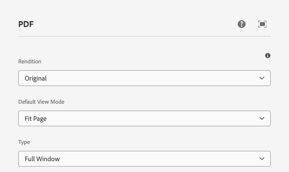
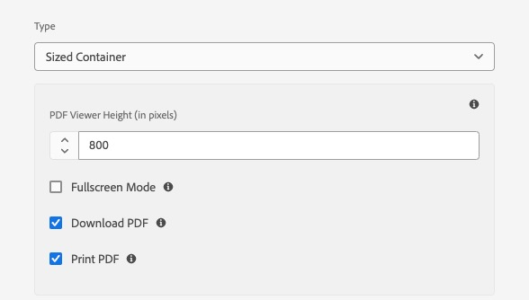
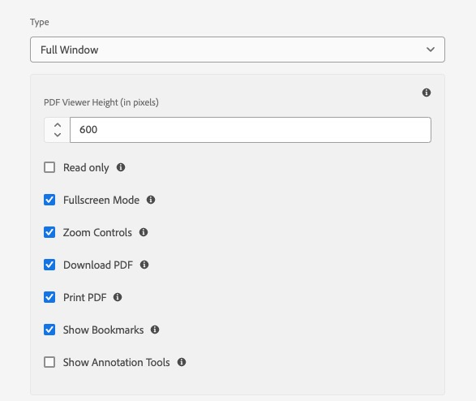
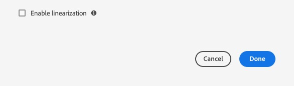

The PDF component displays a PDF rendition for a given Asset using the [Adobe PDF Embed API](https://developer.adobe.com/document-services/docs/overview/pdf-embed-api/).

## Authoring

Authors have several configurations available to choose which asset rendition is displayed.

### Dialog

#### Rendition

A PDF rendition that can be picked from a dropdown that lists all Asset Rendition Names that are registered to Asset Rendition Dispatcher OSGi configurations with `type = pdf`. These values are exposed via [Asset Share Commons' Asset Rendition framework](/asset-share-commons/pages/development/asset-renditions/).

OOTB the available PDF renditions are available:

* Original (maps to static original rendition)
* Pdf (maps to the static rendition with node name matching `*.pdf`)

#### Type

The type of PDF viewer to use. The options are:

* **Sized Container**: The PDF viewer will be sized to the container it is in. This is the default.
* **Full Width**: The PDF viewer will be sized to the full width of the browser window.
* **In-line**: The PDF viewer will be sized to the full width of the browser window, and will be in-line with the rest of the content.

You can explore the different types in the [Adobe PDF Viewer demo](https://documentcloud.adobe.com/view-sdk-demo/PDFEmbedAPI). Note that "Lightbox" is not supported by this component.

#### Default View Mode

The default view of the PDF. The options are:

* **Fit Page**: The PDF will be sized to display the entire page in the viewer.
* **Fit Width**: The PDF will be sized to display the entire width of the page in the viewer.
* **Two Column**: The PDF will be sized to display two columns of the page in the viewer.
* **Two Column Fit Page**: The PDF will be sized to display two columns of the page in the viewer, and the page will be sized to display the entire page in the viewer.

#### Sized Container options

These options only display and are in effect with `Type = Sized Container`.

##### PDF Viewer Height (in pixels)

Height in pixels of the PDF viewer.

###### Fullscreen Mode

Show the full screen button also appears in the bottom toolbar which allows users to view the PDF in full screen mode.

###### Download PDF

Allow download of the PDF.

###### Print PDF

Allow printing of the PDF.

#### Full Window options

These options only display and are in effect with `Type = Full Window`.

##### PDF Viewer Height (in pixels)

Height in pixels of the PDF viewer.

###### Read only

Check this box to true if you want to render the PDF in read-only mode. Commenting is not allowed and existing PDF comments are displayed as read only.

###### Fullscreen Mode

Show the full screen button also appears in the bottom toolbar which allows users to view the PDF in full screen mode.

###### Zoom Controls

Show zoom-in and zoom-out controls in the right-hand panel.

###### Download PDF

Allow download of the PDF.

###### Print PDF

Allow printing of the PDF.

###### Show Bookmarks

Show bookmark controls in the right-hand panel.

#### Enable linearization

Enable linearization to optimize PDFs for faster viewing.

### Policy Dialog

The Policy Dialog is configured on the PDF component's policy via the Editable Templates.

#### Client ID

Enter the client ID for your Adobe Document Cloud account registered with your Adobe Acrobat Viewer. 

A Client ID can be obtained from the [Adobe PDF Embed API Credentials](https://acrobatservices.adobe.com/dc-integration-creation-app-cdn/main.html?api=pdf-embed-api).

## Asset Details Page Selector

In order to use this PDF asset details component, the asset must have a PDF rendition. Often, only PDF assets themselves are expected to be displayed via this component, which means that PDF assets need to have their own Asset Details page.

In order to achieve this Asset -> Asset Details page mapping, is recommended to use the [Content Type Asset Details Selector](/asset-share-commons/pages/development/asset-details-selector/) or develop a custom Asset Details Page Selector, and set it via the [Search Page](/asset-share-commons/pages/development/search-page/#asset-details-page-selector) properties.    

## Technical details

* **Component**: `/apps/asset-share-commons/components/details/pdf`
* **Sling Model**: `com.adobe.aem.commons.assetshare.components.details.impl.PdfImpl`

**Dialog Data Sources**

* **Renditions**: [`com.adobe.aem.commons.assetshare.content.impl.datasources.AssetRenditionsDataSource`](https://github.com/Adobe-Marketing-Cloud/asset-share-commons/blob/develop/core/src/main/java/com/adobe/aem/commons/assetshare/content/impl/datasources/AssetRenditionsDataSource.java) with a filter of `allowedAssetRenditionTypes="[pdf]"`
