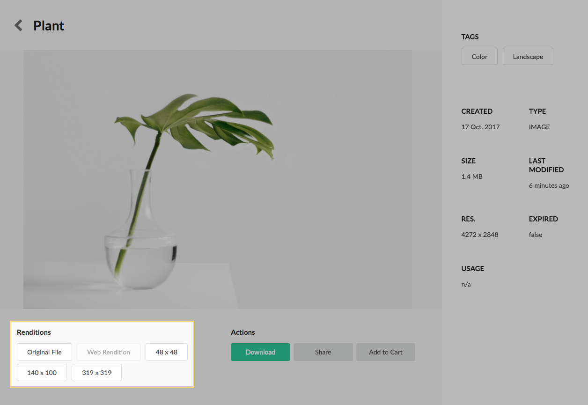
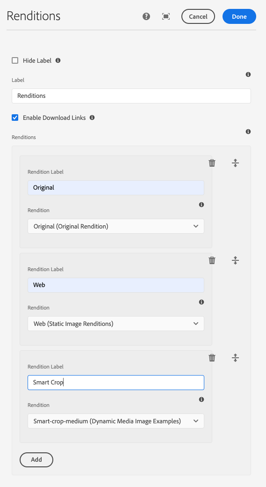

Displays a series of labels representing renditions available or unavailable for a given asset.

## Authoring

Only renditions configured in the dialog will be evaluated for display.

### Dialog / Configuration

#### Hide Label

Select to hide the label.

#### Label

The label for the component.

#### Enable Download Links

Selecting will turn the rendition labels into links allowing end users to directly download individual renditions. If the asset requires a license agreement prior to download the rendition labels will render without links, even with this selected.

#### Renditions

The list of renditions to display.

#### Renditions > Rendition Label 

The human-friendly name presented to the user.

#### Renditions > Rendition 

The actual rendition to download when this rendition option is selected. This is a list of the available named renditions registered with your Asset Share Commons 2.x implementation. 

You can [register custom asset renditions via OSGi configuration](../../development/asset-renditions).

## Technical details

* **Component**: `/apps/asset-share-commons/components/details/renditions`
* **Sling Model**: `com.adobe.aem.commons.assetshare.components.details.impl.RenditionsImpl`

This component allows authors to enter a regular expression pattern. The [java.util.regex.Pattern](https://docs.oracle.com/javase/8/docs/api/java/util/regex/Pattern.html) class is used. If an improper regular expression is inputted an exception will be thrown.