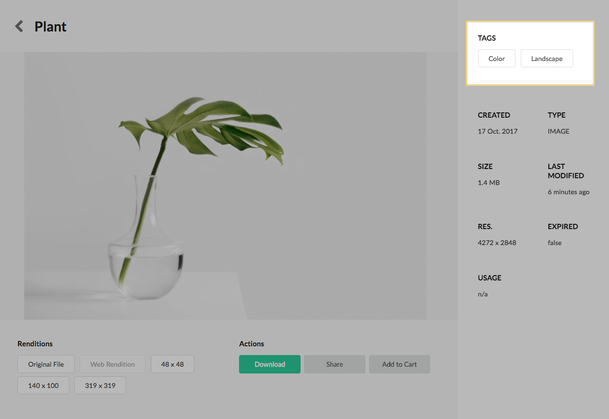
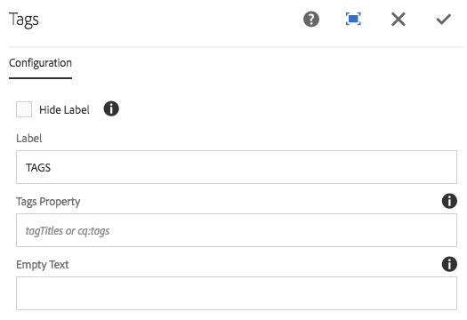

Displays the tags of a current asset. A localized tag title will be used if available.

## Authoring

### Dialog / Configuration

#### Hide Label

Select to hide the tag label.

#### Label

Lable to be displayed above tag items. Will be hidden if the Hide Label select box is selected.

#### Tags Property

(Optional) By default tags are looked for under `<dam:asset>/jcr:content/metadata/cq:tags`. If an author wants to display tags from a different property they can set that property here. Property should be relative to the dam:asset.

#### Empty Text

(Optional) Text to render if no tags are found on the current asset. If the Empty Text field is left empty **AND** no tags are found on the current asset the entire component will be hidden.

## Technical details

* **Component**: `/apps/asset-share-commons/components/details/tags`
* **Sling Model**: `com.adobe.aem.commons.assetshare.components.details.impl.TagsImpl`

#### Computed Tag Titles

The component makes use of the [computed Tag Titles property](../computed-properties.html) to display cq:Tags. The implementation can be found here `com.adobe.aem.commons.assetshare.content.properties.impl.TagTitlesImpl`. 