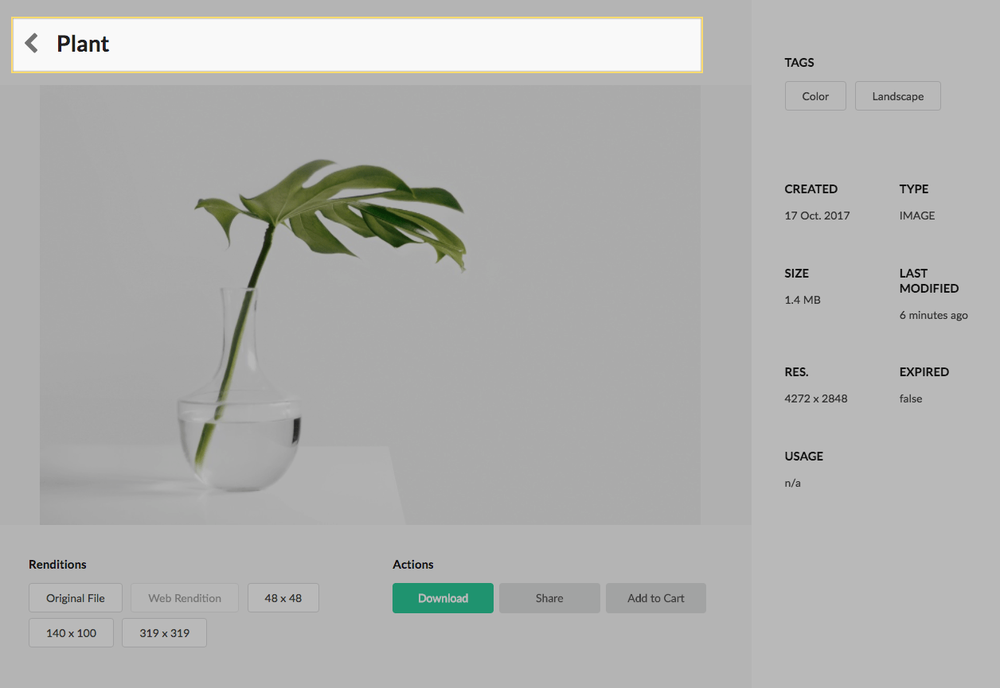
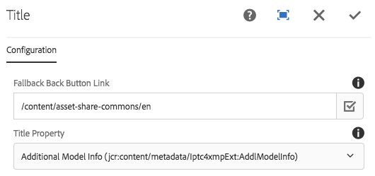
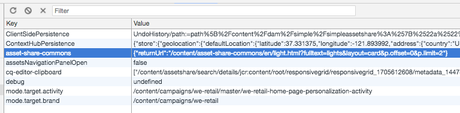

Displays the title of an asset as well as a back button. If a title cannot be found defaults to display the asset's file name.

### Back Button Behavior

The back button (chevron icon) is intended to allow a user to navigate back to the search page without having to re-do the previous search. If a user navigated to the details page via a direct link or some other mechanism a fallback link is used.

## Authoring

### Dialog / Configuration

#### Fallback Button Link

A link to use if a user did not navigate to the details page via a search results page.

#### Title Property

By default the [computed property](../computed-properties.html) Title is used to display the title of the asset. The computed title property looks for the dc:title first and then falls back to the asset name. Optionally a user can explicitly choose a metadata property to look for first. If this property is not found then the component defaults to the computed title logic.

Order of evaluation:

1. Title Property
2. `jcr:content/metadata/dc:title`
3. Asset file name

## Technical details

* **Component**: `/apps/asset-share-commons/components/details/title`
* **Sling Model**: `com.adobe.aem.commons.assetshare.components.details.impl.TitleImpl`

#### Back button client-side details

The back button behavior is implemented with client-side javascript. When a search is performed the search url and parameters are saved to a local storage under `asset-share-commons` with a key of `returnUrl`. The value of `returnUrl` is used to return a user to the search page with the parameters they originally searched for.

* **AssetShare.Navigation JavaScript**: `/apps/asset-share-commons/clientlibs/clientlib-site/js/navigation.js`
* **Title Component JavaScript**: `/apps/asset-share-commons/components/details/title/clientlibs/site/js/title.js`