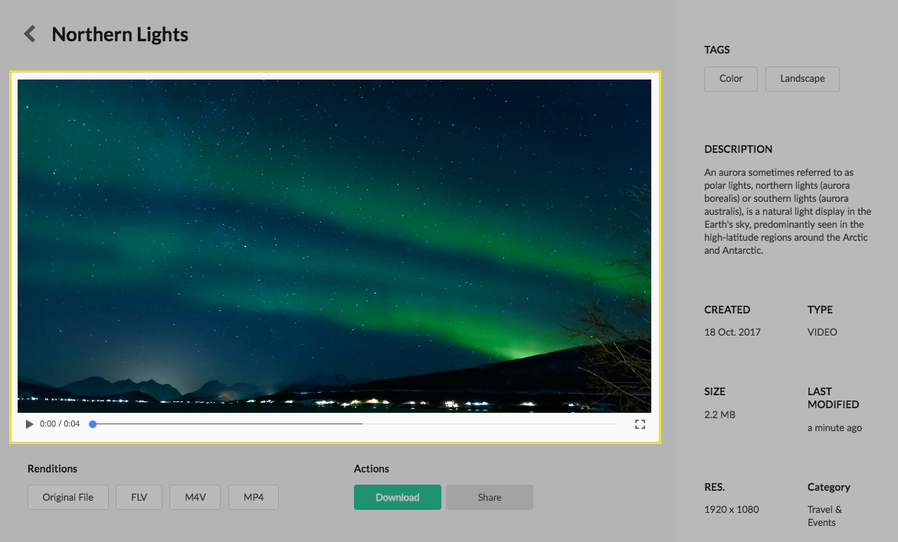
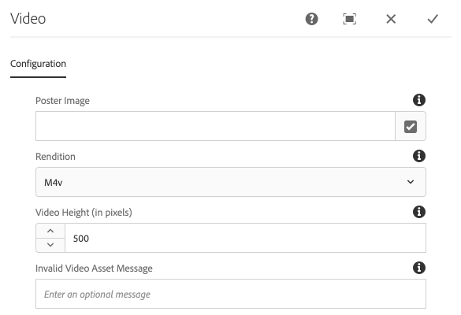

The Video component displays an video preview for a given Asset.

This component should ONLY be placed on an asset details page that is selected to play  video assets.

## Authoring

Authors have several configurations available to choose which asset rendition is displayed.

### Dialog / Configuration

#### Poster Image

An Image asset to display prior to the video loading / being played.

* **Use 'Rendition File Name Regex' defined below** - if selected will use a regular expression defined in the next dialog field to determine the rendition to use.

#### Video Height (in pixels)

The maximum height of the video player in pixels. Leave blank for no maximum height.

#### Invalid Video Asset Message

The message to display if a non-video asset is attempted to be displayed by this component.

#### Rendition Type

Defines what should be used as the video player's source.

* **Use 'Rendition File Name Regex' defined below** - Use the rendition selected by the `Rendition File Name Regex` dialog field below.
* **Asset Path (Computed property)** - Use the asset's full path. 
* **Thumbnail Rendition** - Use the asset's thumbnail rendition's path.

#### Rendition File Name Regex

A regular expression that can be used to match a rendition to be used to display as the image src. Renditions are looked for beneath the `renditions` folder located beneath `<dam:asset>/jcr:content/renditions`.

#### Fallback Image Src

An image can be selected to be used if no rendition for a given asset is found. The fallback image src will be used directly to populate the `src` attribute. Even if the fallback image is an asset in the DAM that has a rendition, only the path will be used.

## Technical details

* **Component**: `/apps/asset-share-commons/components/details/video`
* **Sling Model**: `com.adobe.aem.commons.assetshare.components.details.impl.VideoImpl`

