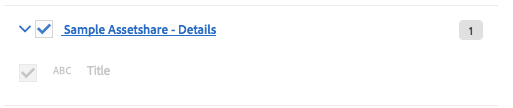

## Extend Components mini-tutorial

> This mini-tutorial builds upon the [Extend Theme Styles mini-tutorial](../theme-styles/#extend-theme-styles-mini-tutorial)


Now that the Status indicator appears in the Search Results it would be nice to display on the Asset Details page as well. Extend the Title details component to display the status on the Asset Details page. Sling resource inheritance is recommended when a change to Component dialog or markup is needed.

#### 1. Create a new Title Component in project

Create a new component in `ui.apps` beneath `/apps/sample-assetshare/components/details`:

```
<?xml version="1.0" encoding="UTF-8"?>
<jcr:root xmlns:sling="http://sling.apache.org/jcr/sling/1.0" xmlns:cq="http://www.day.com/jcr/cq/1.0" xmlns:jcr="http://www.jcp.org/jcr/1.0"
    cq:icon="abc"
    jcr:description="Displays the asset's title."
    jcr:primaryType="cq:Component"
    jcr:title="Title"
    sling:resourceSuperType="asset-share-commons/components/details/title"
    componentGroup="Sample Assetshare - Details"/>
```

The `sling:resourceSuperType` will point to the Asset Share Commons version. Since this is a project specific component the `componentGroup` should be updated for the given project. The `jcr:title` may also need to be updated if it is confusing to see two Title components in the component browser.

#### 2. Update title.html

Copy the `title.html` file from `asset-share-commons/components/details/title/title.html` and paste it beneath the project's Title component. Only a markup change is required, so no additonal resources need to be copied from Asset Share Commons. Add a label for the status:

```
<!--/* title.html */-->
	...
   <div class="content">
   		${title.title}
       <div  data-sly-test.status="${asset.properties['assetStatus']}" 
		      class="ui mini status ${status}status label">
		     ${status @ i18n}
		</div>
	</div>
	...
```
Deploy the new Title component to AEM.

#### 3. Update allowed components for Asset Details Template

Update the Asset Details template to add the componentGroup `Sample Assetshare - Details` as allowed components. 

1. Within the Asset Details template click on the Policy icon for the unlocked layout container in the main column.
2. Update the **Sample Asset Share - Details** policy by checking the `Sample Assetshare - Details` component group.



#### 4. Verify Changes

Navigate to an Asset Details page and delete the Asset Share Commons Title component. Add the new Title component to the page. The title component should now display a "New" or "Updated" label based on the Asset Status computed property.


#### [Full code sample](https://github.com/godanny86/sample-assetshare/tree/master/ui.apps/src/main/content/jcr_root/apps/sample-assetshare/components/details/title)
