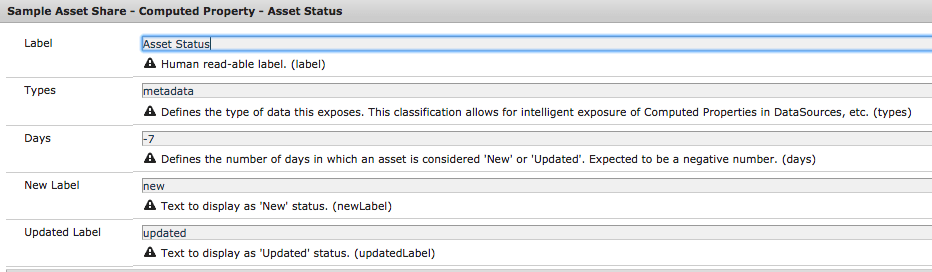
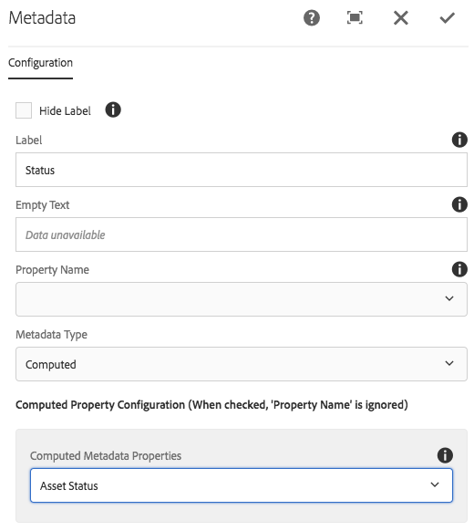

A project specific content structure should be created. At the root of the site, the allowed templates should be configured to allow pages to be created from Project templates. [See this project for minimum content structure](https://github.com/godanny86/sample-assetshare/tree/master/ui.apps/src/main/content/jcr_root/content/sample-assetshare).

## Recommended Content Architecture

```
/content
     /site-root
           /search-page
                /details (default details page - this details page "resolution" can be customized via Java code)
                     /image (details for images)
                     /video (details for videos)
                     /document  (details for word documents)
                     /presentation   (details for power point)
                /actions
                     /cart
                     /download
                     /downloads
                     /share
                     /license
                /specific-search-page-1        
                /specific-search-page-2  
```

More details around the recommended content hierarchy can be found on the [Search Page](../../search/results) documentation.

## Extend Computed Properties mini-tutorial

[Computed Properties](../computed-properties) are used throughout Asset Share Commons to display metadata about an individual asset. Implementing a new computed property is one of the easiest ways to extend Asset Share Commons to meet business requirements.

### [Asset Status - Computed Property](https://github.com/godanny86/sample-assetshare/blob/master/core/src/main/java/com/sample/assetshare/content/properties/impl/AssetStatusImpl.java)

To illustrate the concept of Computed Properties we will be implementing a requirement to show a "New" or "Updated" status indicator if an Asset has been created/modified in the last 7 days. Code snippets below are highlighted to provide additional clarification, the code in full can be found [here](https://github.com/godanny86/sample-assetshare/blob/master/core/src/main/java/com/sample/assetshare/content/properties/impl/AssetStatusImpl.java).

#### 1. Create AssetStatusImpl.java

In your project's core bundle add a new implementation class named `AssetStatusImpl.java`. Our new class will extend `AbstractComputedProperty.class`, an abstract class exposed by Asset Share Commons to make use of several common methods:

```
@Component(service = ComputedProperty.class)
@Designate(ocd = AssetStatusImpl.Cfg.class)
public class AssetStatusImpl extends AbstractComputedProperty<String> {
...
```

By extending the AbstractComputedProperty class our new class will implement the `com.adobe.aem.commons.assetshare.content.properties.ComputedProperty` interface.

#### 2. Add ObjectClassDefinition

Each implementation of a Computed Property needs to provide:

1. **Name** - identifies the Computed Property via a ValueMap 
2. **Label** - a human friendly label, used for data source drop downs
3. **Type** - a classification of the computed property. Valid types are `metadata`, `rendition`, `url`. This is used by data sources to filter which computed properties are shown to a user. A computed property can have multiple types, and custom types can be added.

Using the new OSGi annotations we can add an ObjectClassDefinition which will expose the Label and Types as an OSGi Configuration. We will also add a configuration for Days which will determine the period in which an asset is considered "New" or "Updated", as well as a configurable text for New and Updated labels.

```
 
 public static final String LABEL = "Asset Status";
 public static final String NAME = "assetStatus";
 
 @ObjectClassDefinition(name = "Sample Asset Share - Computed Property - Asset Status")
    public @interface Cfg {
        @AttributeDefinition(
                name = "Label",
                description = "Human read-able label."
        )
        String label() default LABEL;

        @AttributeDefinition(
                name = "Types",
                description = "Defines the type of data this exposes. This classification allows for intelligent exposure of Computed Properties in DataSources, etc."
        )
        String[] types() default {Types.METADATA};
        
        @AttributeDefinition(
                name = "Days",
                description = "Defines the number of days in which an asset is considered 'New' or 'Updated'. Expected to be a negative number."
        )
        int days() default DEFAULT_DAYS;
        
        @AttributeDefinition(
                name = "New Label",
                description = "Text to display as 'New' status."
        )
        String newLabel() default DEFAULT_NEW_LABEL;
        
        @AttributeDefinition(
                name = "Updated Label",
                description = "Text to display as 'Updated' status."
        )
        String updatedLabel() default DEFAULT_UPDATED_LABEL;
    }
    
    @Override
    public String getName() {
        return NAME;
    }

    @Override
    public String getLabel() {
        return cfg.label();
    }

    @Override
    public String[] getTypes() {
       return cfg.types();
    }
    
    @Activate
    protected void activate(Cfg cfg) {
        this.cfg = cfg;
    }
    
```
 
The `@Activate` method ensures that if a change is made via the OSGi configuration the component is updated.

#### 3. Populate getter method

Finally we can populate the `get(Asset, SlingHttpServletRequest)` method. This is the entry point in which the real "work" of the computed property takes place. The `com.day.cq.dam.api.Asset` parameter represents the current Asset. `SlingHttpServletRequest` parameters is the current request (useful for internationalization). We will simply get the `jcr:created` and `jcr:content/jcr:lastModified` properties from the current asset and compare them to a date 7 days ago. This will determine the status label returned.

```
...
    @Override
    public String get(Asset asset, SlingHttpServletRequest request) {
        
        final ValueMap assetProperties = getAssetProperties(asset);
        Calendar assetCreated = assetProperties.get(JcrConstants.JCR_CREATED, Calendar.class);
        Calendar assetModified = assetProperties.get(JcrConstants.JCR_CONTENT + "/" + JcrConstants.JCR_LASTMODIFIED, Calendar.class);
        
        //Get a calendar to compare to
        Calendar weekOld = getCompareCalendar(cfg.days());
       
        if(assetCreated.after(weekOld)) {
            //if asset created < one week ago
            return cfg.newLabel();
        } else if (assetModified.after(weekOld)) {
            //if asset modified < one week ago
            return cfg.updatedLabel();
        }
        return null;
    }
        
    /***
     * 
     * @return a Calendar object to compare asset dates to
     */
    private Calendar getCompareCalendar(int daysOld) {
        Calendar compareCal = Calendar.getInstance();
        // reset hour, minutes, seconds and millis
        compareCal.set(Calendar.HOUR_OF_DAY, 0);
        compareCal.set(Calendar.MINUTE, 0);
        compareCal.set(Calendar.SECOND, 0);
        compareCal.set(Calendar.MILLISECOND, 0);
        compareCal.add(Calendar.DAY_OF_MONTH, daysOld);
        
        return compareCal;
    }
...
```

#### 4. Verify deployment of Computed Property

After building and deploying the project, navigate to the [OSGi Config manager](http://localhost:4502/system/console/configMgr/com.sample.assetshare.content.properties.impl.AssetStatusImpl). The new computed property and OSGi config should be there.



Lastly open up the dialog of a Metadata component on one of the Asset Details pages. The Asset Status should now appear in the Computed Property drop down in the dialog:



##### [Full code sample](https://github.com/godanny86/sample-assetshare/blob/master/core/src/main/java/com/sample/assetshare/content/properties/impl/AssetStatusImpl.java)
