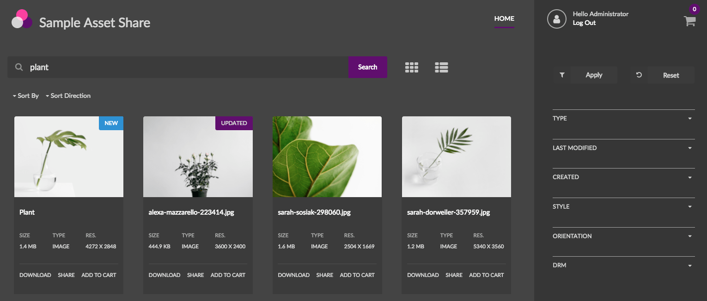
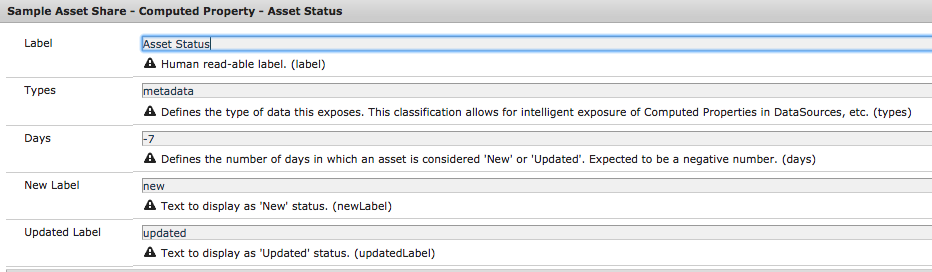
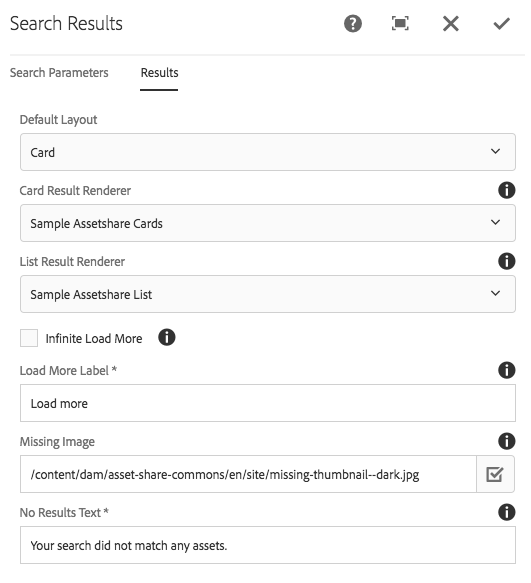
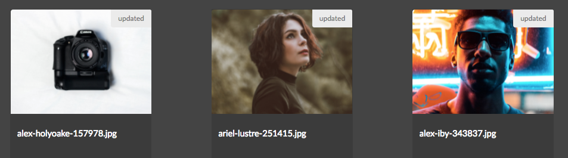
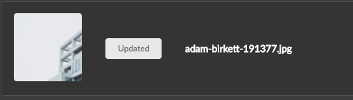
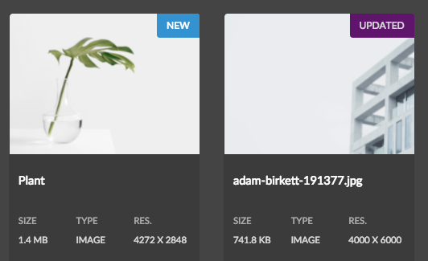
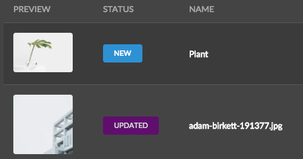
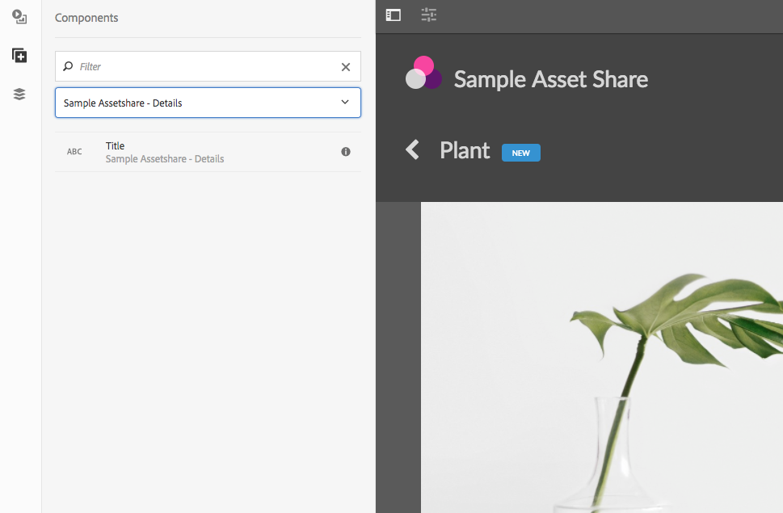

There are many ways Asset Share Commons can extended or customized to meet specific project needs. This guide outlines how to:

* Create an AEM project that extends Asset Share Commons
* Support theming in Asset Share Commons
* Add custom placeholder assets
* Define project-specific Asset Share Commons editable templates
* Set up the page architecture for Asset Share Commons
* Create a custom Computed Property
* Create a custom search result renderer
* Augment an existing Asset Details component

The guide's narrative centers around implementing a custom requirement to show a status label for New and Updated assets. Pertinent code snippets are included below. The full code for the [sample project can be found on GitHub](https://github.com/godanny86/sample-assetshare).



## Using with Maven

With any AEM project it is recommended to create a Maven Multimodule project to manage and deploy code and configurations. [ACS AEM Lazybones](https://github.com/Adobe-Consulting-Services/lazybones-aem-templates) and [Maven Archetype 10](https://helpx.adobe.com/experience-manager/using/first-arch10.html) are great tools to quickly create the project structure.

### Use Maven Bundle Plugin v 3.3.0+

Asset Share Commons uses the latest OSGi annotations. In the `<pluginManagement>` section of your project's **parent** pom.xml ensure that the `maven-bundle-plugin` is using a version 3.3.0 or higher.

```
<!-- parent pom.xml -->
...
<build>
	<pluginManagement>
    	<plugins>
    	...
       <plugin>
       	<groupId>org.apache.felix</groupId>
          <artifactId>maven-bundle-plugin</artifactId>
          <version>3.3.0</version>
       </plugin>
       ...
   </pluginManagement>
</build>
```

### Add Asset Share Commons as a Dependency

In the `<dependencies>` section of your project's **parent** pom.xml add this:

```
<!-- parent pom.xml -->
<dependencies>
	...
	<dependency>
		<groupId>com.adobe.aem.commons</groupId>
  		<artifactId>assetshare.core</artifactId>
  		<version>1.0.0</version>
   		<scope>provided</scope>
 	</dependency>
 	<dependency>
		<groupId>com.adobe.aem.commons</groupId>
		<artifactId>assetshare.ui.apps</artifactId>
  		<version>1.0.0</version>
   		<scope>provided</scope>
   		<type>content-package</type>
	</dependency>
	...
<dependencies>
```

In the `<dependencies>` section of your project's OSGi bundle module (**core**) pom.xml add this:

```
<!-- core pom.xml -->
<dependencies>
	...
	<dependency>
		<groupId>com.adobe.aem.commons</groupId>
  		<artifactId>assetshare.core</artifactId>
 	</dependency>
	...
<dependencies>
```

In the `<dependencies>` section of your project's content module (**ui.apps**) pom.xml add this:

```
<!-- ui.apps pom.xml -->
<dependencies>
	...
	<dependency>
		<groupId>com.adobe.aem.commons</groupId>
  		<artifactId>assetshare.core</artifactId>
 	</dependency>
 	<dependency>
		<groupId>com.adobe.aem.commons</groupId>
		<artifactId>assetshare.ui.apps</artifactId>
  		<version>1.0.0</version>
	</dependency>
	...
<dependencies>
```

### Add Asset Share Commons as a Sub Package

In the `content-package-maven-plugin` section of your project's content module (**ui.apps**) pom.xml add this:

```
<!-- ui.apps pom.xml -->
<plugins>
	...
     <plugin>
     	<groupId>com.day.jcr.vault</groupId>
       <artifactId>content-package-maven-plugin</artifactId>
       <extensions>true</extensions>
       <configuration>
       	...
          <subPackages>
          	<subPackage>
             	  <groupId>com.adobe.aem.commons</groupId>
  				  <artifactId>assetshare.ui.apps</artifactId>
               <filter>true</filter>
             </subPackage>
         </subPackages>
         ...
     </configuration>
   </plugin>
   ...
</plugins>
```

### Example POM files

1. [Parent POM](https://github.com/godanny86/sample-assetshare/blob/master/pom.xml)
2. [ui.apps POM](https://github.com/godanny86/sample-assetshare/blob/master/ui.apps/pom.xml)
3. [core POM](https://github.com/godanny86/sample-assetshare/blob/master/core/pom.xml)


## Project Theme Client Library

It is recommended to create a project specific theme to be used to style a project's Asset Share. Asset Share Commons includes two themes: Light and Dark. It is easiest to choose one of these themes to start, create a copy and then customize. A copy of the theme should be saved beneath the project's `/apps/clientlibs` folder. This client library will need to be included in the Page Design for all the templates used in the project.

* Light: `/apps/asset-share-commons/clientlibs/clientlib-theme/semanticui-light`
* Dark:  `/apps/asset-share-commons/clientlibs/clientlib-theme/semanticui-dark`

See the [Theming](../../theming) page for more details on customizing a theme. See here for a sample [clientlib based on Dark Theme](https://github.com/godanny86/sample-assetshare/tree/master/ui.apps/src/main/content/jcr_root/apps/sample-assetshare/clientlibs/clientlib-theme/semanticui-sample). Also see **Extend Theme Styles** below for a real-world scenario in extending the theme styles.

## Project Asset Placeholder

Throughout the Asset Share Commons project a default Asset Placeholder is used if a valid dam:Asset cannot be resolved. This is quite common when authoring Asset Share Commons pages and is useful to preview how metadata/renditions will be rendered. It is recommended to create a project-specific placeholder asset to be used. The Placeholder asset functionality only occurs in the Author environment. In the Publish environment if an Asset can not be resolved a 404 error code will be thrown.

Example Placeholder asset: `/apps/asset-share-commons/resources/placeholder.jpeg`. 

Since the Placeholder assets only get rendered in the Author environment it is ok to save them beneath the project's `/apps` folder. 

***NOTE** the Placeholder Asset should not be confused with a **Not Found** thumbnail. Several components like the [Search Results component](../../search/results) and the [Image component](../../details/image) allow an author to set a Not Found thumbnail to be used if the current asset does not have a valid thumbnail. The Not Found asset **must** be in the DAM or publicly accessible (should never be beneath `/apps`).

## Editable Templates

Creating project-specific editable templates is the recommended way of integrating Asset Share Commons into a project. The [ui.content](https://github.com/Adobe-Marketing-Cloud/asset-share-commons/releases/tag/asset-share-commons.ui.content-1.0.0) package includes examples of the templates and template-types needed under `/conf/asset-share-commons/settings/wcm/`. *Note that two sets of templates are included in ui.content to support both the Light and Dark theme examples. A project implementation most likely only needs a single set. [See for project-specific templates and template types](https://github.com/godanny86/sample-assetshare/tree/master/ui.apps/src/main/content/jcr_root/conf/sample-assetshare/settings/wcm)

### Template Types

When setting up a new project it is easiest to copy the template types from `/conf/asset-share-commons/settings/wcm/template-types` in to the project's `/conf` folder.

**Search Template Type**

* Required
* `sling:resourceType` : `asset-share-commons/components/structure/search-page`
* example: `/conf/asset-share-commons/settings/wcm/template-types/search-page`
* For Search Pages, includes page properties tab for search configuration.

**Asset Details Template Type**

* Required
* `sling:resourceType` : `asset-share-commons/components/structure/details-page`
* example: `/conf/asset-share-commons/settings/wcm/template-types/details-page`
* For Asset Detail pages, includes page properties tab for detail page configuration.

**Empty Template Type**

* Required
* `sling:resourceType` : `asset-share-commons/components/structure/page`
* example: `/conf/asset-share-commons/settings/wcm/template-types/empty-page`
* For action modal pages, license agreement terms and conditions and any other blank content pages. 

**Rail Template Type**

* (Optional)
* `sling:resourceType` : `asset-share-commons/components/structure/page`
* example: `/conf/asset-share-commons/settings/wcm/template-types/rail-page`
* For content pages with a rail that add supporting content to the Asset Share portal. 

### Templates

Due to the complex structure of Editable Templates it is recommended to create each project specific Template using the Template Editor in the AEM UI. Templates found beneath `/conf/asset-share-commons/settings/wcm/templates` should be used as a reference but should NOT be copied directly into a project's `/conf` directory. A Structure policy should be created to include *Asset Share Commons - Structure* components (Header, Footer, User menu...) on each Template. Allowed Components policies should also be configured based on the template. Lastly the Page Design for each Template needs to be configured to point to a Semantic UI theme client library (preferrably a project specific one). [See for project-specific templates.](https://github.com/godanny86/sample-assetshare/tree/master/ui.apps/src/main/content/jcr_root/conf/sample-assetshare/settings/wcm)


**Search Template**

* `cq:templateType` : `	
/conf/<project>/settings/wcm/template-types/search-page`
* example: `/conf/asset-share-commons/settings/wcm/templates/search-template`
* Structure Policy: *Asset Share Commons - Structure*, *Layout Container*
* Allowed Components: *Asset Share Commons - Content*, *Asset Share Commons - Search*

**Details Template**

* `cq:templateType` : `	
/conf/<project>/settings/wcm/template-types/details-page`
* example: `/conf/asset-share-commons/settings/wcm/templates/details-template`
* Structure Policy: *Asset Share Commons - Structure*, *Layout Container*
* Allowed Components: *Asset Share Commons - Content*, *Asset Share Commons - Details*

**Action Template**

* `cq:templateType` : `	
/conf/<project>/settings/wcm/template-types/empty-page`
* example: `/conf/asset-share-commons/settings/wcm/templates/action-template`
* Structure Policy: *Asset Share Commons - Structure*, *Layout Container*
* Allowed Components: *Asset Share Commons - Modals*

**Content Rail Template**

* `cq:templateType` : `	
/conf/<project>/settings/wcm/template-types/rail-page`
* example: `/conf/asset-share-commons/settings/wcm/templates/content-rail-template`
* Structure Policy: *Asset Share Commons - Structure*, *Layout Container*
* Allowed Components: *Asset Share Commons - Content*

**Empty Template**

* `cq:templateType` : `	
/conf/<project>/settings/wcm/template-types/empty-page`
* example: `/conf/asset-share-commons/settings/wcm/templates/empty-template`
* Structure Policy: *Asset Share Commons - Structure*, *Layout Container*
* Allowed Components: *Asset Share Commons - Content*

## Content

A project specific content structure should be created. At the root of the site, the allowed templates should be configured to allow pages to be created from Project templates. [See this project for minimum content structure](https://github.com/godanny86/sample-assetshare/tree/master/ui.apps/src/main/content/jcr_root/content/sample-assetshare).

### Recommended Content Architecture

```
/content
     /site-root
           /search-page
                /details (default details page)
                     /image (details for images)
                     /video (details for videos)
                     /document  (details for word documents)
                     /presentation   (details for power point)
                /actions
                     /cart
                     /download
                     /share
                     /license
                /specific-search-page-1        
                /specific-search-page-2  
```

More details around the recommended content hierarchy can be found on the [Search Page](../../search/results) documentation.

## Extend Computed Properties

[Computed Properties](../computed-properties) are used throughout Asset Share Commons to display metadata about an individual asset. Implementing a new computed property is one of the easiest ways to extend Asset Share Commons to meet business requirements.

### [Asset Status - Computed Property](https://github.com/godanny86/sample-assetshare/blob/master/core/src/main/java/com/sample/assetshare/content/properties/impl/AssetStatusImpl.java)

To illustrate the concept of Computed Properties we will be implementing a requirement to show a "New" or "Updated" status indicator if an Asset has been created/modified in the last 7 days. Code snippets below are highlighted to provide additional clarification, the code in full can be found [here](https://github.com/godanny86/sample-assetshare/blob/master/core/src/main/java/com/sample/assetshare/content/properties/impl/AssetStatusImpl.java).

#### 1. Create AssetStatusImpl.java

In your project's core bundle add a new implementation class named `AssetStatusImpl.java`. Our new class will extend `AbstractComputedProperty.class`, an abstract class exposed by Asset Share Commons to make use of several common methods:

```
@Component(service = ComputedProperty.class)
@Designate(ocd = AssetStatusImpl.Cfg.class)
public class AssetStatusImpl extends AbstractComputedProperty<String> {
...
```

By extending the AbstractComputedProperty class our new class will implement the `com.adobe.aem.commons.assetshare.content.properties.ComputedProperty` interface.

#### 2. Add ObjectClassDefinition

Each implementation of a Computed Property needs to provide:

1. **Name** - identifies the Computed Property via a ValueMap 
2. **Label** - a human friendly label, used for data source drop downs
3. **Type** - a classification of the computed property. Valid types are `metadata`, `rendition`, `url`. This is used by data sources to filter which computed properties are shown to a user. A computed property can have multiple types, and custom types can be added.

Using the new OSGi annotations we can add an ObjectClassDefinition which will expose the Label and Types as an OSGi Configuration. We will also add a configuration for Days which will determine the period in which an asset is considered "New" or "Updated", as well as a configurable text for New and Updated labels.

```
 
 public static final String LABEL = "Asset Status";
 public static final String NAME = "assetStatus";
 
 @ObjectClassDefinition(name = "Sample Asset Share - Computed Property - Asset Status")
    public @interface Cfg {
        @AttributeDefinition(
                name = "Label",
                description = "Human read-able label."
        )
        String label() default LABEL;

        @AttributeDefinition(
                name = "Types",
                description = "Defines the type of data this exposes. This classification allows for intelligent exposure of Computed Properties in DataSources, etc."
        )
        String[] types() default {Types.METADATA};
        
        @AttributeDefinition(
                name = "Days",
                description = "Defines the number of days in which an asset is considered 'New' or 'Updated'. Expected to be a negative number."
        )
        int days() default DEFAULT_DAYS;
        
        @AttributeDefinition(
                name = "New Label",
                description = "Text to display as 'New' status."
        )
        String newLabel() default DEFAULT_NEW_LABEL;
        
        @AttributeDefinition(
                name = "Updated Label",
                description = "Text to display as 'Updated' status."
        )
        String updatedLabel() default DEFAULT_UPDATED_LABEL;
    }
    
    @Override
    public String getName() {
        return NAME;
    }

    @Override
    public String getLabel() {
        return cfg.label();
    }

    @Override
    public String[] getTypes() {
       return cfg.types();
    }
    
    @Activate
    protected void activate(Cfg cfg) {
        this.cfg = cfg;
    }
    
```
 
The `@Activate` method ensures that if a change is made via the OSGi configuration the component is updated.

#### 3. Populate getter method

Finally we can populate the `get(Asset, SlingHttpServletRequest)` method. This is the entry point in which the real "work" of the computed property takes place. The `com.day.cq.dam.api.Asset` parameter represents the current Asset. `SlingHttpServletRequest` parameters is the current request (useful for internationalization). We will simply get the `jcr:created` and `jcr:content/jcr:lastModified` properties from the current asset and compare them to a date 7 days ago. This will determine the status label returned.

```
...
    @Override
    public String get(Asset asset, SlingHttpServletRequest request) {
        
        final ValueMap assetProperties = getAssetProperties(asset);
        Calendar assetCreated = assetProperties.get(JcrConstants.JCR_CREATED, Calendar.class);
        Calendar assetModified = assetProperties.get(JcrConstants.JCR_CONTENT + "/" + JcrConstants.JCR_LASTMODIFIED, Calendar.class);
        
        //Get a calendar to compare to
        Calendar weekOld = getCompareCalendar(cfg.days());
       
        if(assetCreated.after(weekOld)) {
            //if asset created < one week ago
            return cfg.newLabel();
        } else if (assetModified.after(weekOld)) {
            //if asset modified < one week ago
            return cfg.updatedLabel();
        }
        return null;
    }
        
    /***
     * 
     * @return a Calendar object to compare asset dates to
     */
    private Calendar getCompareCalendar(int daysOld) {
        Calendar compareCal = Calendar.getInstance();
        // reset hour, minutes, seconds and millis
        compareCal.set(Calendar.HOUR_OF_DAY, 0);
        compareCal.set(Calendar.MINUTE, 0);
        compareCal.set(Calendar.SECOND, 0);
        compareCal.set(Calendar.MILLISECOND, 0);
        compareCal.add(Calendar.DAY_OF_MONTH, daysOld);
        
        return compareCal;
    }
...
```

#### 4. Verify deployment of Computed Property

After building and deploying the project, navigate to the [OSGi Config manager](http://localhost:4502/system/console/configMgr/com.sample.assetshare.content.properties.impl.AssetStatusImpl). The new computed property and OSGi config should be there.



Lastly open up the dialog of a Metadata component on one of the Asset Details pages. The Asset Status should now appear in the Computed Property drop down in the dialog:


##### [Full code sample](https://github.com/godanny86/sample-assetshare/blob/master/core/src/main/java/com/sample/assetshare/content/properties/impl/AssetStatusImpl.java)


## Extend Search Results Renderer

Now that we have created a new computed property we want do display the Asset Status in the search results.

#### 1. Create [Card](https://github.com/godanny86/sample-assetshare/tree/master/ui.apps/src/main/content/jcr_root/apps/sample-assetshare/components/search/card) and [List](https://github.com/godanny86/sample-assetshare/tree/master/ui.apps/src/main/content/jcr_root/apps/sample-assetshare/components/search/list) Result Components

In your project's `/apps/components` directory in ui.apps add two new components named `card` and `list`.

**Card Component**

```
<?xml version="1.0" encoding="UTF-8"?>
<jcr:root xmlns:sling="http://sling.apache.org/jcr/sling/1.0" xmlns:cq="http://www.day.com/jcr/cq/1.0" xmlns:jcr="http://www.jcp.org/jcr/1.0"
    jcr:primaryType="cq:Component"
    jcr:title="Sample Assetshare Cards"
    sling:resourceSuperType="asset-share-commons/components/search/results/result/card"
    componentGroup=".hidden"
    extensionType="asset-share-commons/search/results/result/card"/>

```

**List Component**

```
<?xml version="1.0" encoding="UTF-8"?>
<jcr:root xmlns:sling="http://sling.apache.org/jcr/sling/1.0" xmlns:cq="http://www.day.com/jcr/cq/1.0" xmlns:jcr="http://www.jcp.org/jcr/1.0"
    jcr:primaryType="cq:Component"
    jcr:title="Sample Assetshare List"
    sling:resourceSuperType="asset-share-commons/components/search/results/result/list"
    componentGroup=".hidden"
    extensionType="asset-share-commons/search/results/result/list"/>
```

The `sling:resourceSuperType` inherits from the Default Asset Share Commons card and list components. The `extensionType` ensures the components will appear in the Search Results component dialog. The `extensionType` must be set on your components in order for the datasource that populates the dialog dropdown to find them.

#### 2. Copy Card and List Template HTL files

Create a folder named `templates` beneath the card and list components. Copy the HTL template files from the Default Asset Share components beneath the respective components. The structure should look like this:

```
/apps/sample-assetshare/components/search
			/card
				/templates
					card.html (copied from /apps/asset-share-commons/components/search/results/result/card/templates/card.html)
			/list
				/templates
					list.html (copied from /apps/asset-share-commons/components/search/results/result/list/templates/list.html)
```

#### 3. Update list.html

Update the header template to add a new column heading for Status after the Preview thumbnail.

```
<template data-sly-template.header="${@ search}">
	<thead>
		<tr><th class="left aligned">Preview</th>
       <th>${'Status' @i18n}</th>
   ...
```

Update the row template to add a column to display the Asset Status computed property. Add the column after the image column (second column).

```
<template data-sly-template.row="${@ asset = result, config = config }">
	...
	<td class="image">
			<a href="${assetDetails.url @ suffix = asset.path}"></a>
	</td>
	<!--/* Asset Status Computed Property */-->
	 <td><div data-sly-test.status="${asset.properties['assetStatus']}"
        		class="ui status ${status}status label">
        		${status @ i18n}
        </div>
     </td>	...
```

#### 4. Update card.html

Add a status label on in the card template directly after the `img` tag inside the `article` tag.

```
<template data-sly-template.card="${@ asset = result, config = config }">
	...
      <a class="image cmp-image__wrapper--card" href="${assetDetails.url @ suffix = asset.path}">
            
       </a>
       <div data-sly-test.status="${asset.properties['assetStatus']}" 
		     class="ui top right attached status ${status}status label">${status @ i18n}</div>
	...
		     
```
#### 5. Update Search Results Card and List Renderer

Deploy the new components to AEM. On a Search Results page update the Search Results Component dialog to use the custom Card and List renderers.



You should now see the Asset Status indicator in the search results (for new and updated assets within the last 7 days).





Of course some style changes could be used (especially on Card view).

#### [Full code sample](https://github.com/godanny86/sample-assetshare/tree/master/ui.apps/src/main/content/jcr_root/apps/sample-assetshare/components/search)

## Extend Theme Styles

LESS and CSS updates should be made in the Semantic UI Theme client library if updating the style for a Semantic UI element (label, card, button, etc...). The Status indicator makes use of the [Semantic UI Label elment](https://semantic-ui.com/elements/label.html).

#### 1. Add 'New' and 'Updated' Color Variables

Add new color variables for @newStatusColor and @updatedStatusColor in your clientlib-theme's `global/theme.variables` file. As a best practice it is recommended to place any color variables related to the theme in this file.

Add the following to the bottom of `/apps/sample-assetshare/clientlibs/clientlib-theme/semanticui-sample/themes/dark/globals/theme.variables`. We can re-use the primary color for the Update status and the New status will be a blue.

```
...

/* Status Labels */
@newStatusColor : #2185D0;
@updatedStatusColor : @primaryColor;

```

#### 2. Update label.overrides in theme

The concept of a "Status" label is new, and so add a new rule to `label.overrides` file beneath the dark theme folder: `/apps/sample-assetshare/clientlibs/clientlib-theme/semanticui-sample/themes/dark/elements/label.overrides`.

```
...
/* Status Labels */

/* Uppercase all status */
.ui.status.labels .label,
.ui.status.label {
	text-transform: uppercase;
}

/* New Status */
.ui.status.newstatus.labels .label,
.ui.status.newstatus.label {
  background-color: @newStatusColor !important;
  border-color: @newStatusColor !important;
  color: @white !important;
}

/* Updated Status */
.ui.status.updatedstatus.labels .label,
.ui.status.updatedstatus.label {
  background-color: @updatedStatusColor !important;
  border-color: @updatedStatusColor !important;
  color: @textColor !important;
}

```

#### 3. Verify Changes

Deploy updates to the clientlibs to AEM. Occasionally LESS are not picked up automatically by AEM client libraries. In order to force an update: delete the clientlib-theme folder benath `/var`: `/var/clientlibs/apps/sample-assetshare/clientlibs/clientlib-theme`.





#### Full Code Samples

* [clientlib-theme](https://github.com/godanny86/sample-assetshare/tree/master/ui.apps/src/main/content/jcr_root/apps/sample-assetshare/clientlibs/clientlib-theme/semanticui-sample)
* [theme.variables](https://github.com/godanny86/sample-assetshare/blob/master/ui.apps/src/main/content/jcr_root/apps/sample-assetshare/clientlibs/clientlib-theme/semanticui-sample/themes/dark/globals/theme.variables)
* [label.overrides](https://github.com/godanny86/sample-assetshare/blob/master/ui.apps/src/main/content/jcr_root/apps/sample-assetshare/clientlibs/clientlib-theme/semanticui-sample/themes/dark/elements/label.overrides)

## Extend Components

Now that the Status indicator appears in the Search Results it would be nice to display on the Asset Details page as well. Extend the Title details component to display the status on the Asset Details page. Sling resource inheritance is recommended when a change to Component dialog or markup is needed.

#### 1. Create a new Title Component in project

Create a new component in `ui.apps` beneath `/apps/sample-assetshare/components/details`:

```
<?xml version="1.0" encoding="UTF-8"?>
<jcr:root xmlns:sling="http://sling.apache.org/jcr/sling/1.0" xmlns:cq="http://www.day.com/jcr/cq/1.0" xmlns:jcr="http://www.jcp.org/jcr/1.0"
    cq:icon="abc"
    jcr:description="Displays the asset's title."
    jcr:primaryType="cq:Component"
    jcr:title="Title"
    sling:resourceSuperType="asset-share-commons/components/details/title"
    componentGroup="Sample Assetshare - Details"/>
```

The `sling:resourceSuperType` will point to the Asset Share Commons version. Since this is a project specific component the `componentGroup` should be updated for the given project. The `jcr:title` may also need to be updated if it is confusing to see two Title components in the component browser.

#### 2. Update title.html

Copy the `title.html` file from `asset-share-commons/components/details/title/title.html` and paste it beneath the project's Title component. Only a markup change is required, so no additonal resources need to be copied from Asset Share Commons. Add a label for the status:

```
<!--/* title.html */-->
	...
   <div class="content">
   		${title.title}
       <div  data-sly-test.status="${asset.properties['assetStatus']}" 
		      class="ui mini status ${status}status label">
		     ${status @ i18n}
		</div>
	</div>
	...
```
Deploy the new Title component to AEM.

#### 3. Update allowed components for Asset Details Template

Update the Asset Details template to add the componentGroup `Sample Assetshare - Details` as allowed components. 

1. Within the Asset Details template click on the Policy icon for the unlocked layout container in the main column.
2. Update the **Sample Asset Share - Details** policy by checking the `Sample Assetshare - Details` component group.


#### 4. Verify Changes

Navigate to an Asset Details page and delete the Asset Share Commons Title component. Add the new Title component to the page. The title component should now display a "New" or "Updated" label based on the Asset Status computed property.



#### [Full code sample](https://github.com/godanny86/sample-assetshare/tree/master/ui.apps/src/main/content/jcr_root/apps/sample-assetshare/components/details/title)
