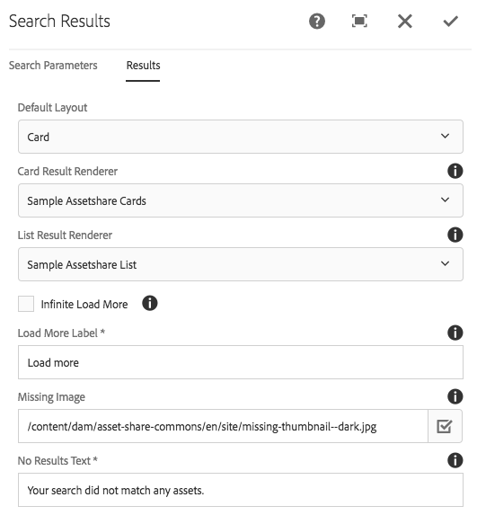
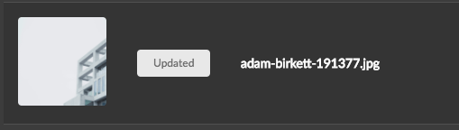

Asset Share Commons has several extension points for Search, including:

* Pre-process the QueryBuilder query prior to execution the search by implementing `com.adobe.aem.commons.assetshare.search.provider.QuerySearchPreProcessor` interface as OSGi Service.
* Post-process the QueryBuilder results prior to returning them to the search results page by implementing `com.adobe.aem.commons.assetshare.search.provider.QuerySearchPreProcessor` interface as OSGi Service.
* Ability to create custom search result views, as described below in the [Extend Search Results Renderer mini-tutorial](#extend-search-results-mini-tutorial)

## Extend Search Results Renderer mini-tutorial

> This mini-tutorial builds upon the [Extend Computed Properties mini-tutorial](../content/index.html#extend-computed-properties-mini-tutorial)


Now that we have created a new computed property we want do display the Asset Status in the search results.

#### 1. Create [Card](https://github.com/godanny86/sample-assetshare/tree/master/ui.apps/src/main/content/jcr_root/apps/sample-assetshare/components/search/card) and [List](https://github.com/godanny86/sample-assetshare/tree/master/ui.apps/src/main/content/jcr_root/apps/sample-assetshare/components/search/list) Result Components

In your project's `/apps/components` directory in `ui.apps` add two new components named `card` and `list`.

**Card Component**

```
<?xml version="1.0" encoding="UTF-8"?>
<jcr:root xmlns:sling="http://sling.apache.org/jcr/sling/1.0" xmlns:cq="http://www.day.com/jcr/cq/1.0" xmlns:jcr="http://www.jcp.org/jcr/1.0"
    jcr:primaryType="cq:Component"
    jcr:title="Sample Assetshare Cards"
    sling:resourceSuperType="asset-share-commons/components/search/results/result/card"
    componentGroup=".hidden"
    extensionType="asset-share-commons/search/results/result/card"/>

```

**List Component**

```
<?xml version="1.0" encoding="UTF-8"?>
<jcr:root xmlns:sling="http://sling.apache.org/jcr/sling/1.0" xmlns:cq="http://www.day.com/jcr/cq/1.0" xmlns:jcr="http://www.jcp.org/jcr/1.0"
    jcr:primaryType="cq:Component"
    jcr:title="Sample Assetshare List"
    sling:resourceSuperType="asset-share-commons/components/search/results/result/list"
    componentGroup=".hidden"
    extensionType="asset-share-commons/search/results/result/list"/>
```

The `sling:resourceSuperType` inherits from the Default Asset Share Commons card and list components. The `extensionType` ensures the components will appear in the Search Results component dialog. The `extensionType` must be set on your components in order for the datasource that populates the dialog dropdown to find them.

#### 2. Copy Card and List Template HTL files

Create a folder named `templates` beneath the card and list components. Copy the HTL template files from the Default Asset Share components beneath the respective components. The structure should look like this:

```
/apps/sample-assetshare/components/search
			/card
				/templates
					card.html (copied from /apps/asset-share-commons/components/search/results/result/card/templates/card.html)
			/list
				/templates
					list.html (copied from /apps/asset-share-commons/components/search/results/result/list/templates/list.html)
```

#### 3. Update list.html

Update the header template to add a new column heading for Status after the Preview thumbnail.

```
<template data-sly-template.header="${@ search}">
	<thead>
		<tr><th class="left aligned">Preview</th>
       <th>${'Status' @i18n}</th>
   ...
```

Update the row template to add a column to display the Asset Status computed property. Add the column after the image column (second column).

```
<template data-sly-template.row="${@ asset = result, config = config }">
	...
	<td class="image">
			<a href="${assetDetails.url @ suffix = asset.path}"></a>
	</td>
	<!--/* Asset Status Computed Property */-->
	 <td><div data-sly-test.status="${asset.properties['assetStatus']}"
        		class="ui status ${status}status label">
        		${status @ i18n}
        </div>
     </td>	...
```

#### 4. Update card.html

Add a status label on in the card template directly after the `img` tag inside the `article` tag.

```
<template data-sly-template.card="${@ asset = result, config = config }">
	...
      <a class="image cmp-image__wrapper--card" href="${assetDetails.url @ suffix = asset.path}">
            
       </a>
       <div data-sly-test.status="${asset.properties['assetStatus']}" 
		     class="ui top right attached status ${status}status label">${status @ i18n}</div>
	...
		     
```
#### 5. Update Search Results Card and List Renderer

Deploy the new components to AEM. On a Search Results page update the Search Results Component dialog to use the custom Card and List renderers.




You should now see the Asset Status indicator in the search results (for new and updated assets within the last 7 days).




Of course some style changes could be used (especially on Card view).

#### [Full code sample](https://github.com/godanny86/sample-assetshare/tree/master/ui.apps/src/main/content/jcr_root/apps/sample-assetshare/components/search)
