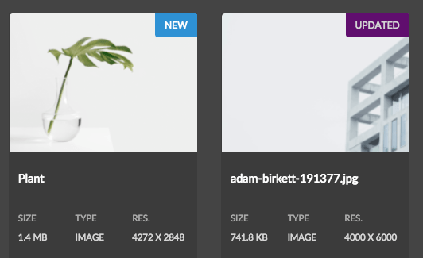

## Extend Theme Styles mini-tutorial

> This mini-tutorial builds upon the [Extend Search Results Renderer mini-tutorial](../search/#extend-search-results-renderer-mini-tutorial)


LESS and CSS updates should be made in the Semantic UI Theme client library if updating the style for a Semantic UI element (label, card, button, etc...). The Status indicator makes use of the [Semantic UI Label element](https://semantic-ui.com/elements/label.html).

#### 1. Add 'New' and 'Updated' Color Variables

Add new color variables for @newStatusColor and @updatedStatusColor in your clientlib-theme's `global/theme.variables` file. As a best practice it is recommended to place any color variables related to the theme in this file.

Add the following to the bottom of `/apps/sample-assetshare/clientlibs/clientlib-theme/semanticui-sample/themes/dark/globals/theme.variables`. We can re-use the primary color for the Update status and the New status will be a blue.

```
...

/* Status Labels */
@newStatusColor : #2185D0;
@updatedStatusColor : @primaryColor;

```

#### 2. Update label.overrides in theme

The concept of a "Status" label is new, and so add a new rule to `label.overrides` file beneath the dark theme folder: `/apps/sample-assetshare/clientlibs/clientlib-theme/semanticui-sample/themes/dark/elements/label.overrides`.

```
...
/* Status Labels */

/* Uppercase all status */
.ui.status.labels .label,
.ui.status.label {
	text-transform: uppercase;
}

/* New Status */
.ui.status.newstatus.labels .label,
.ui.status.newstatus.label {
  background-color: @newStatusColor !important;
  border-color: @newStatusColor !important;
  color: @white !important;
}

/* Updated Status */
.ui.status.updatedstatus.labels .label,
.ui.status.updatedstatus.label {
  background-color: @updatedStatusColor !important;
  border-color: @updatedStatusColor !important;
  color: @textColor !important;
}

```

#### 3. Verify Changes

Deploy updates to the clientlibs to AEM. Occasionally LESS are not picked up automatically by AEM client libraries. In order to force an update: delete the clientlib-theme folder benath `/var`: `/var/clientlibs/apps/sample-assetshare/clientlibs/clientlib-theme`.




#### Full Code Samples

* [clientlib-theme](https://github.com/godanny86/sample-assetshare/tree/master/ui.apps/src/main/content/jcr_root/apps/sample-assetshare/clientlibs/clientlib-theme/semanticui-sample)
* [theme.variables](https://github.com/godanny86/sample-assetshare/blob/master/ui.apps/src/main/content/jcr_root/apps/sample-assetshare/clientlibs/clientlib-theme/semanticui-sample/themes/dark/globals/theme.variables)
* [label.overrides](https://github.com/godanny86/sample-assetshare/blob/master/ui.apps/src/main/content/jcr_root/apps/sample-assetshare/clientlibs/clientlib-theme/semanticui-sample/themes/dark/elements/label.overrides)
