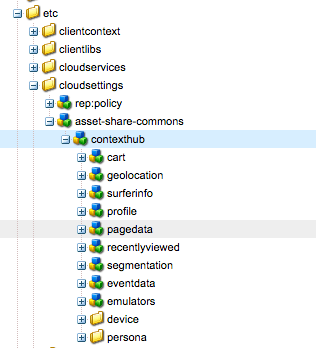

## v1.2.2 release notes

### Fixed
- 0123: Fixed issued with OOTB ContextHub store type nodes not installing.

## Important upgrade considerations

After this installation, your `/etc/cloudsettings/asset-share-commons/contexthub` should have the following nodes:

The user menu has changed to use ContextHub to manage the anonymous vs authenticated state in the user menu component.

* Ensure the ContextHub is set on the Asset Share root page to `/etc/cloudsettings/asset-share-commons/contexthub`
* It maybe necessary to clear the browser cache to reload changed JavaScript.
* An AJAX HTTP GET is made to `/libs/granite/security/currentuser.json?nocache=<time-in-ms>` on page loads to retrieve the current user. This URI must be allowed via AEM Dispatcher.  
* An AJAX HTTP GET is made to `/home/users/.../<user>.infinity.json` on page loads to retrieve the current user. This URI must be allowed via AEM Dispatcher. This is a standard request made by the OOTB ContextHub Profile store.  