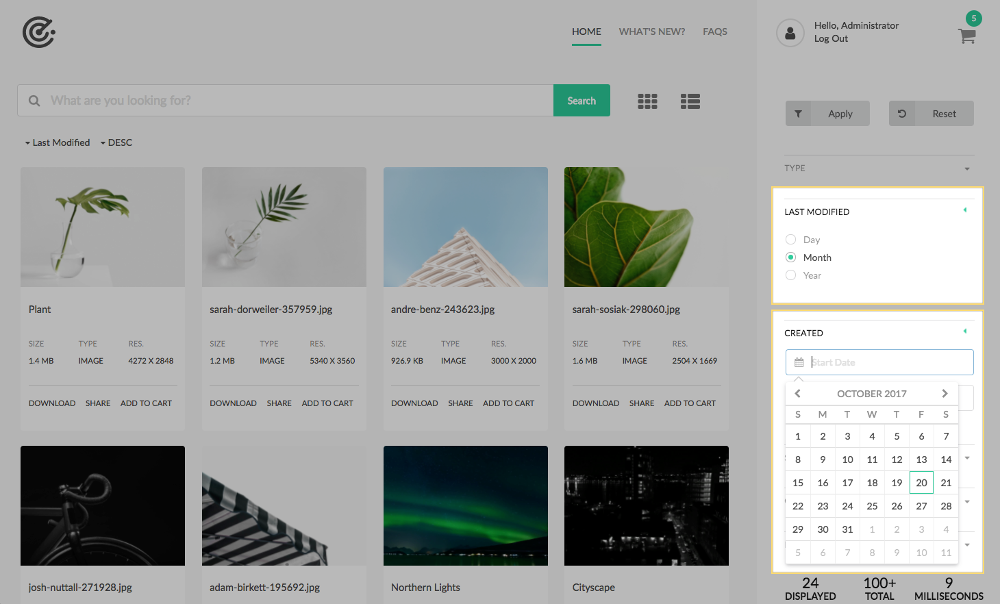
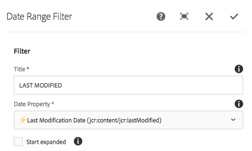
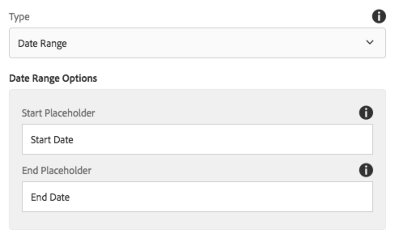
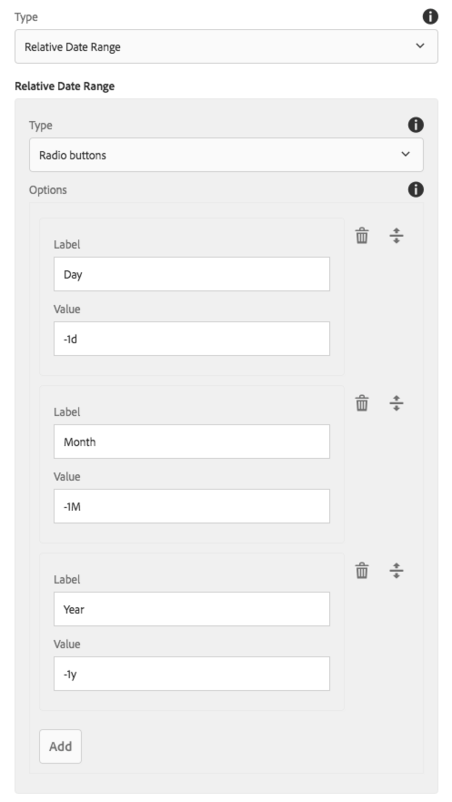

The Date Range Filter allows user to filter assets by date. There are two methods for date filtering: Date Range and Relative Date Range.

### Date Range

The asset's date must fall between the user-selected start and end dates (the dates are evaluated at 12:00AM of the selected day).

* If no end date is specified, the asset's date must occur after the start date.
* If no start date is specified, the asset's date must occur before the end date.

### Relative Date Range 

The asset's date be within the user-selected relative date range. See Authoring > Relative Date range below for details.

## Authoring

### Dialog / Common fields



#### Title

Label for the filter

#### Date Property

List of Asset metadata properties available for filtering.

* Labels/Properties are derived from available Metadata Schemas
* Lightning (⚡) indicates this property is optimized for search.
* Turtle (🐢) indicates this property is NOT optimized for search.

#### Auto-Search on Change (v1.3.0)

Select to automatically perform a search whenever the end-user selected filter criteria of this component changes.

#### Start Expanded

Select to initially render the component filter in an expanded mode, showing the selection options.

#### Type

Specifies the type of date range filtering to use.

* Date Range
    * User specifies an absolute date range (start and end dates)
* Relative Date Range
    * User specifies a relative date range evaluated from "today".
    * ie. In the last 7 days, or within 2 weeks from now.

### Dialog / Date Range fields 



#### Start Placeholder 
The placeholder text to display in the "start date" input field. 

#### End Placeholder
The placeholder text to display in the "end date" input field. 

### Dialog / Relative Date Range fields



#### Type

The form controls to render for each relative date selection. All options are single selections.

* Radio buttons
* Slider
* Toggle
	        
#### Options

Options define what can be selected 	

* **Label**: The label to display to the user
* **Value**: The relative date value, in the format `<number-of-units>s|m|h|d|w|M|y`
    * `s` - for seconds
    * `m` - for minutes
    * `h` – for hours
    * `d` – for days
    * `w` – for weeks
    * `M` – for months
	    * All months are 30 days
	* `y` – for years
	    * Leap years NOT taken into consideration.
	    
All values can be positive (future) or negative (past).

* `7d` is days in the future.
* `-7d` days in the past.

## Technical details

* **Component**: `/apps/asset-share-commons/components/search/date-range`
* **Sling Model**: `com.adobe.aem.commons.assetshare.search.predicates.impl.DateRangeImpl`

This filter leverages AEM Query Builder's [DateRangePredicateEvaluator](https://docs.adobe.com/content/docs/en/aem/6-3/develop/ref/javadoc/com/day/cq/search/eval/DateRangePredicateEvaluator.html) and
[RelativeDateRangePredicateEvaluator](https://docs.adobe.com/content/docs/en/aem/6-3/develop/ref/javadoc/com/day/cq/search/eval/RelativeDateRangePredicateEvaluator.html) predicate evaluators. 


#### Date Range

Example generated Query Builder date range predicate output: 

```
1_group.daterange.property=jcr:created
1_group.daterange.lowerBound=2017-9-16
1_group.daterange.upperBound=2017-10-16
```      

#### Relative Date Range

Example generated Query Builder date range predicate output: 

```
2_group.relativedaterange.property=jcr:content/jcr:lastModified
2_group.relativedaterange.lowerBound=-1M
```