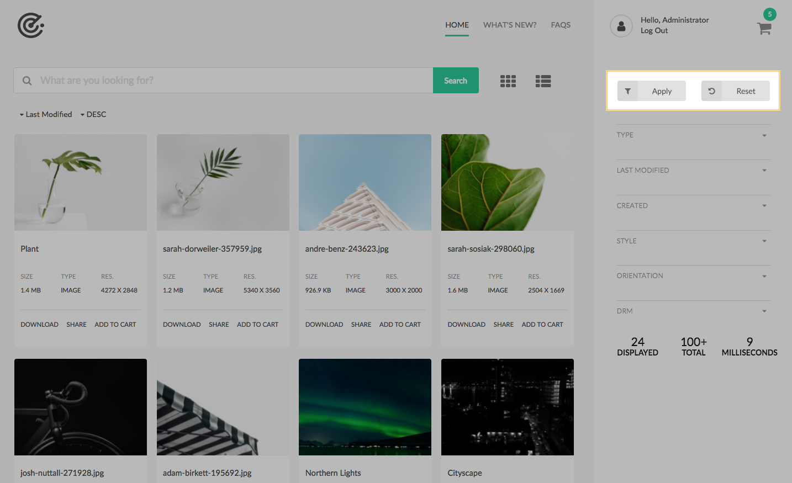
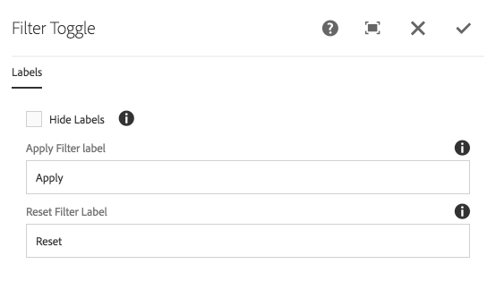

The Filter Toggle component is used to apply newly selected filters or reset all filters.

* Apply executes a _new_ search request based on the current state of the search filter form.
* Reset will refresh the page so it loads without any user-specified query parameters.

## Authoring

The Filter Toggle allows for setting the labels for each button or hiding labels.

### Dialog / Lables
 
 
 
#### Hide Labels

Select to hide the text labels next to the icons.
    
#### Apply Filter Label

The label to display on the apply filter button.

  * Label is hidden when Hide Labels is selected. 

#### Reset Filter Label
The label to display on the filter reset button.

  * Label is hidden when Hide Labels is selected. 
                    
## Technical details

* **Component**: `/apps/asset-share-commons/components/search/filter-toggle`
* **Sling Model**: `Not applicable`