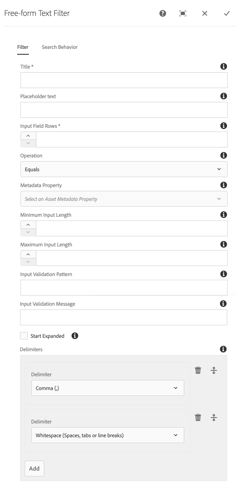

The Free-form Text component renders a text field or text area, allowing users to enter delimited search terms, using pre-authored operators such as: equals, starts with, contains.

## Authoring

The Free-form Text component supports authoring of text and labels as well as search input size, operation and delimiters.

### Dialog / Filter tab

 

#### Title

Label for the filter.

#### Placeholder text

[Placeholder text](https://developer.mozilla.org/en-US/docs/Web/HTML/Element/input/text#placeholder) to display as greyed out inside the input when it is empty.

#### Input Field Rows

The number of rows the input field should be.

* 1 row results in a text field
* Greater than 1 row results in a text area

#### Operation

The search operation to perform between the Metadata Property and Option(s).

  * Equals
    * Metadata property exactly matches at least 1 delimited input value (see Delimiters below)
  * Starts with
    * Metadata property starts with at least 1 delimited input value (see Delimiters below). [This is not a "true" starts with, rather it matches any term or word in the configured property, even when the match is not the first term or word in the property value](https://github.com/adobe/asset-share-commons/issues/1049). 
  * Contains
    * Metadata property contains at least 1 delimited input value (see Delimiters below)
    * *Note that contains maybe effect search performance. Please discuss common use of "contains" with your application support team."*


#### Metadata Property

 List of Asset metadata properties available for filtering.

 * Labels/Properties are derived from available Metadata Schemas
 * Lightning icon (⚡) indicates this property is optimized for search.
 * Turtle icon (🐢) indicates this property is NOT optimized for search.

Note that different operations have different "fast" and "slow" properties.

#### Minimum Input Length

The [minimum allowed number of characters](https://developer.mozilla.org/en-US/docs/Web/HTML/Element/input/text#minlength) allowed in the field.
*Note that the operation of `Starts with` has a forced minimum of 3 input characters for performance reasons.*

#### Maximum Input Length

The [maximum number of characters](https://developer.mozilla.org/en-US/docs/Web/HTML/Element/input/text#maxlength) allowed in the field.

#### Input Validation Pattern

*Only works when Input Field Rows is 1, due to HTML5 limitations.*

Create an [HTML5 input validation pattern](https://developer.mozilla.org/en-US/docs/Web/HTML/Element/input/text#pattern) to validate the field input. Note that delimiters must be taken into account when defining the pattern.


#### Input Validation Message

*Only works when Input Field Rows is 1, due to HTML5 limitations.*

Input validation message to display if input validation fails. Leave blank to use default browser messages.


#### Start Expanded

Select to initially display the component filter in an expanded mode, showing the selection options.

#### Delimiters

Defines delimiters for the input. Upon processing this filters input, the user provided input will be split on ALL defined delimiters, and the search will take place on EACH delimited value.
Only a single delimited value has to match the Operation for the Metadata Property for this predicate to consider the result a match.

  * Comma (,)
  * Whitespace (Spaces, tabs or line breaks)
  * Dash (-)
  * Underscore (_)
  * Pipe (\|)
  * Colon (:)
  * Tilde (~)
  * Custom
    * Allows you to enter a custom delimiter of any character/s.
  * None (Supersedes any other selected delimiters)
    * If None is selected, then all other delimiters configured for the component instance are ignored.




## Technical details

* **Component**: `/apps/asset-share-commons/components/search/freeform-text`
* **Sling Model**: `com.adobe.aem.commons.assetshare.search.predicates.impl.FreeformTextPredicateImpl`

This filter implements a wrapped version of AEM Query Builder's [JcrPropertyPredicateEvaluator](https://docs.adobe.com/docs/en/aem/6-3/develop/ref/javadoc/com/day/cq/search/eval/JcrPropertyPredicateEvaluator.html).
The Asset Share Commons' provided predicate wrapper (`com.adobe.aem.commons.assetshare.search.impl.predicateevaluators.PropertyValuesPredicateEvaluator`) allows for the values to be provided as comma-delimited values to be transformed into `#_value` parameters for evaluation by AEM's JcrPropertyPredicateEvaluator;

Example generated Query Builder predicate output:

```
1_group.propertyvalues.property=./jcr:content/metadata/my:sku
1_group.propertyvalues.operation=startsWith
1_group.propertyvalues.0_values=PRD-12,PRD-33,PRD-44
1_group.propertyvalues.0_delimiter=,
1_group.propertyvalues.0_delimiter=__WS  // Reserved whitespace token
```
