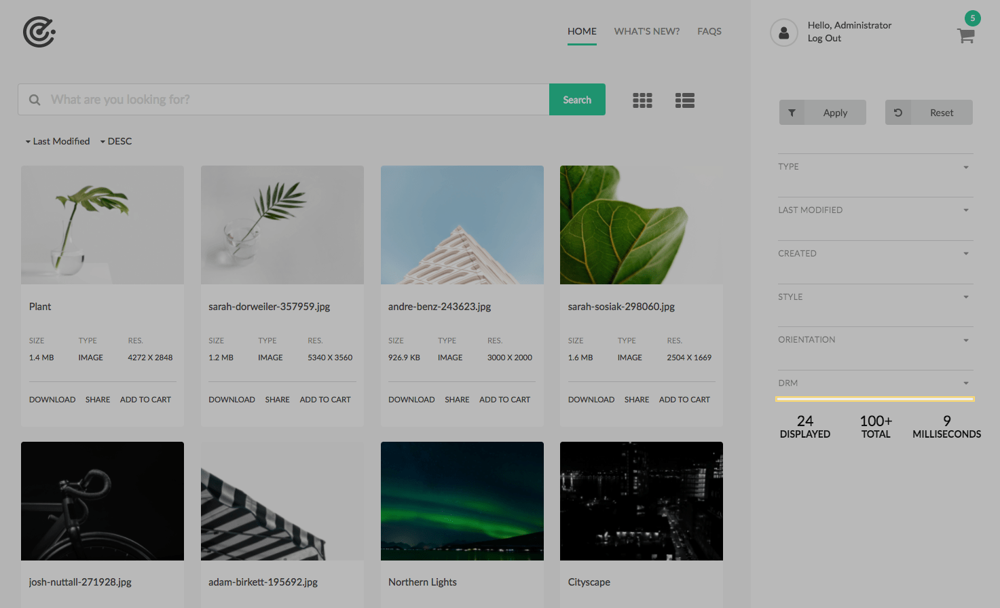
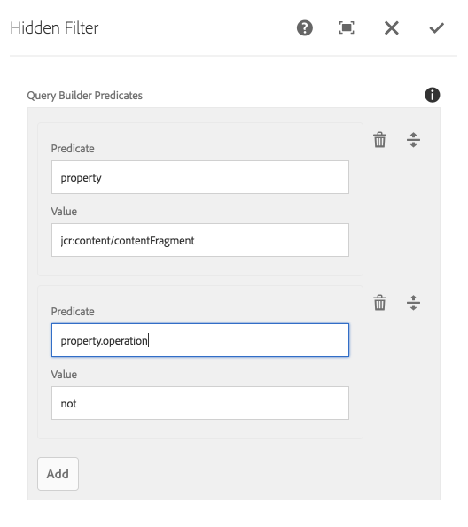

Hidden Filters are invisible to users, and are used by AEM authors to define mandatory query restrictions.
Hidden filters allow AEM authors to define groups of AEM Query Builder predicates that are collected and applied server side for all searches. 

Hidden Filter components display a placeholder to AEM Authors (in Edit mode) but do not render visually to the user.

## Authoring

The Hidden Filter defines Query Builder parameters that are always included in the search. In order to successfully author Hidden Filters, a proficiency in AEM QueryBuilder predicate syntax is required.

Common use cases include:
* Removing Content Fragments from search results.
* Removing sub-assets from search results.
* Building pre-defined search landing page portals.

### Dialog
 
 
 
#### Query Builder Predicates

Allows the definition of individual Query Builder predicates.

 * **Predicate**: The query builder predicate
 * **Value**: The predicate's value
                        
Query Builder groups are automatically prefixed to each set of predicates defined in a Hidden Filter component; each discrete Hidden Filter component on the search page gets its own Query Builder group.

All Predicates in a Hidden Filter are part of the same group, so in order to achieve desired filtering, several discrete Hidden Filter components may be required (as each set will be OR'd together).        

## Pro-tip

Implementing Hidden Predicate parameters as [SearchPredicate](/asset-share-commons/apidocs/com/adobe/aem/commons/assetshare/search/searchpredicates/SearchPredicate.html) (set on the [Search Results component](/asset-share-commons/pages/search/results/))
is a nice way to make applying required parameters easy and understandable.

... and fon't forget to contribute them back to the Asset Share Commons project!

## Technical details

* **Component**: `/apps/asset-share-commons/components/search/hidden`
* **Sling Model**: `com.adobe.aem.commons.assetshare.search.predicates.impl.HiddenPredicateImpl`, `com.adobe.aem.commons.assetshare.search.predicates.impl.PagePredicateImpl`

Unlike other Search components users can interact with, Hidden Filter parameters are not passed in via HTTP query parameters.
Instead, they are collected server-side prior to query execution. 