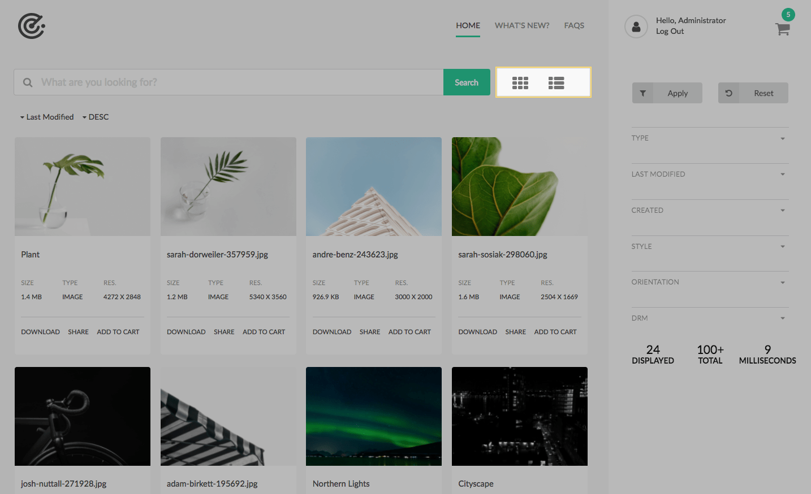
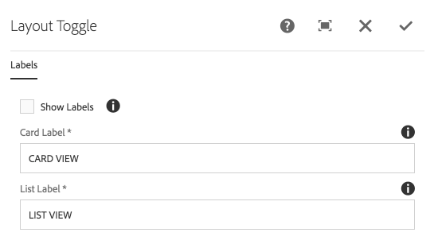

The Layout Toggle component is used to expose controls for toggling the result view between views (card and list).
Clicking on a view will re-execute the query and display the previous result set in the new view.

## Authoring

The Layout Toggle allows for setting the labels for each view or disabling labels.

### Dialog
 
 
 
#### Show Label

Select to display the text labels next to the icons.
    
#### Card Label

The label to display next to the card toggle icon

  * Label only displays when Show Labels is selected. 

#### List Label

The label to display next to the list toggle icon.

  * Label only displays when Show Labels is selected. 
                    
## Technical details

* **Component**: `/apps/asset-share-commons/components/search/layout-toggle`
* **Sling Model**: `N/A`

This control sets a special query parameter of `layout` which instructs the `AssetShare.Search` JavaScript which view to request to render the results.

