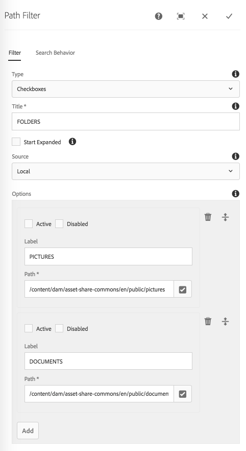

The Path Filter component displays controls that allow an end-user to refine search's based on pre-defined Asset folder path restrictions.
Path filters can either be single select or multi-select; at this time only checkboxes support multi-select.

## Authoring

### Dialog / Filter tab
 
 
 
#### Type
 
 The form controls to display for this filter.
 
  * Checkboxes _(Multi select)_
  * Radio buttons _(Single select)_
  * Drop-down _(Single select)_
  * Slider _(Single select)_
  * Toggle _(Single select)_

#### Title
 
Label for the filter.
 
#### Auto-Search on Change     

Select to automatically perform a search whenever the end-user selected filter criteria of this component changes.

#### Start Expanded        

Select to initially display the component filter in an expanded mode, showing the selection options.
    
#### Source

Enumerates available filter options (ie. values)

  * Local
    * User-defined list of Labels and comma delimited Paths
        * Paths MUST start with `/content/dam`
    * Active: Check to default this value to selected.
    * Disabled: Check to prevent users from changing this selection.          
  
  * Datasource
    * Sling resource type for the [Granite UI DataSource](https://docs.adobe.com/docs/en/aem/6-3/develop/ref/granite-ui/api/jcr_root/libs/granite/ui/docs/server/datasource.html) to populate the options.
    * This resource type is implemented and provided by the IT delivery team.



## Technical details

* **Component**: `/apps/asset-share-commons/components/search/path`
* **Sling Model**: `com.adobe.aem.commons.assetshare.search.predicates.impl.PathPredicateImpl`

This filter leverages AEM Query Builder's [PathPredicateEvaluator](https://docs.adobe.com/docs/en/aem/6-3/develop/ref/javadoc/com/day/cq/search/eval/PathPredicateEvaluator.html). 

Example generated Query Builder predicate output: 

```
1_group.1_path=/content/dam/my/assets
1_group.2_path=/content/dam/my/other/assets
```      

This filter component forces the following [AEM QueryBuilder Path](https://helpx.adobe.com/experience-manager/6-3/sites/developing/using/reference-materials/javadoc/com/day/cq/search/eval/PathPredicateEvaluator.html) Predicate properties:

* `exact` = `false`
    * *if exact is true/on, the exact path must match, but it can contain simple wildcards (*), that match names, but not "/"; if it is false (default) all descendants are included.*
* `flat` = `false`
    * *searches only the direct children (like appending "/*" in xpath) (only used if 'exact' is not true, optional)*
* `self` = `true`
    * *searches the subtree but includes the base node given as path (no wildcards)*

