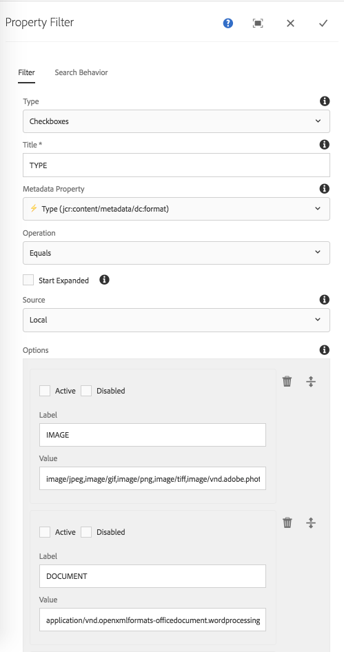

The Property Filter component displays controls that allow an end-user to refine search's based on pre-defined Asset property restrictions.

Filters can either be single select or multi-select; at this time only checkboxes support multi-select.

## Authoring

### Dialog / Filter tab
 
 
 
#### Type
 
 The form controls to display for this filter.
 
  * Checkboxes _(Multi select)_
  * Radio buttons _(Single select)_
  * Drop-down _(Single select)_
  * Slider _(Single select)_
  * Toggle _(Single select)_

#### Title
 
Label for the filter.
 
#### Metadata Property
 
 List of Asset metadata properties available for filtering.
 
 * Labels/Properties are derived from available Metadata Schemas
 * Lightning icon (⚡) indicates this property is optimized for search.
 * Turtle icon (🐢) indicates this property is NOT optimized for search.

#### Operation

The search operation to perform between the Metadata Property and Option(s). 
    
  * Equals
    * Metadata property exactly matches value
  * Does not equals
    * Metadata property does not matches value
        

#### Start Expanded        

Select to initially display the component filter in an expanded mode, showing the selection options.
    
#### Source

Enumerates available filter options (ie. values)

  * Local
    * User-defined list of Labels and comma delimited values.
    * Comma delimited values are evaluated as OR's.
    * Active: Check to default this value to selected.
    * Disabled: Check to prevent users from changing this selection.          
  
  * Datasource
    * Sling resource type for the [Granite UI DataSource](https://docs.adobe.com/docs/en/aem/6-3/develop/ref/granite-ui/api/jcr_root/libs/granite/ui/docs/server/datasource.html) to populate the options.
    * This resource type is implemented and provided by the IT delivery team.



## Technical details

* **Component**: `/apps/asset-share-commons/components/search/property`
* **Sling Model**: `com.adobe.aem.commons.assetshare.search.predicates.impl.PropertyPredicateImpl`

This filter implements a wrapped version of AEM Query Builder's [JcrPropertyPredicateEvaluator](https://docs.adobe.com/docs/en/aem/6-3/develop/ref/javadoc/com/day/cq/search/eval/JcrPropertyPredicateEvaluator.html). 
The Asset Share Commons' provided predicate wrapper (`com.adobe.aem.commons.assetshare.search.impl.predicateevaluators.PropertyValuesPredicateEvaluator`) allows for the values to be provided as comma-delimited values to be transformed into `#_value` parameters for evaluation by AEM's JcrPropertyPredicateEvaluator; 

Example generated Query Builder predicate output: 

```
1_group.propertyvalues.property=./jcr:content/metadata/dc:format
1_group.propertyvalues.operation=equals
1_group.propertyvalues.0_values=image/jpeg,image/png,image/gif
1_group.propertyvalues.1_values=application/pdf
```      


