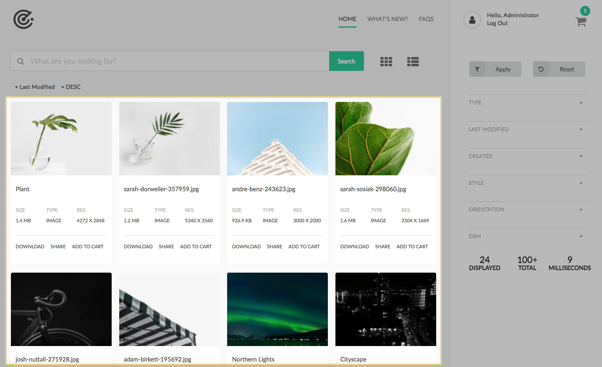
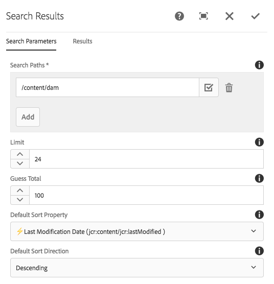
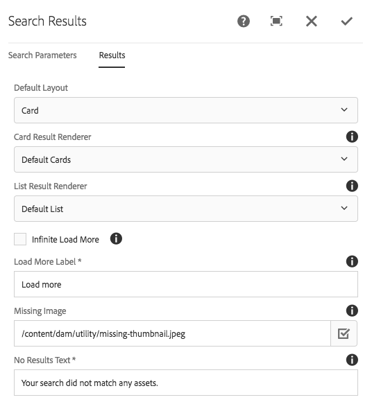

The Search Results component is the only **REQUIRED** component for the Search Page to work. 

This component is responsible for displaying search results, and provides the (hidden) HTML Form element which is used as the bases for search query submissions. Without the Search Results component no results will be available, and no other Search component will work.
 

## Authoring

### Dialog / Sort Parameters
    

 
#### Search Paths
  
Paths to restrict the search to.    

  * *When multiple paths are selected,Search Relevancy (`@jcr:score`) sort order may be adversely affected due to how Oak handles score-based sorting across UNION'd queries*

#### Search Restrictions (v1.6.0)

Server-side Search Predicates to include in the search.

* OOTB Search Predicates:
    * Exclude content fragments
    * Exclude expired assets
    * Exclude sub-assets

*Custom Search Predicates can be created by implementing the [SearchPredicate](https://javadoc.io/doc/com.adobe.aem.commons/assetshare.core/latest/com/adobe/aem/commons/assetshare/search/searchpredicates/SearchPredicate.html) interface.*

#### Limit

The number of results to include on each "load more" page.
 
#### Guess Total

  * Set to `-1` to let AEM pick a good limit.
  * *In order to ensure performant queries, [guess total is required](https://docs.adobe.com/docs/en/aem/6-3/develop/search/querybuilder-api.html#Using p.guessTotal to return the results).*

#### Default Sort Property

The initial page load's sort property.

  * Drop-down is limited to properties optimized for sorting.

#### Default Sort Direction

The initial page load's sort direction.

Since v1.6.4, an entry for this property should exist in the Sort component, if the Sort component is used.
                
### Dialog / Results tab
        

        
#### Default Layout

The default result layout (Card or List). 

#### Card Result Renderer

The card renderer implementation (Asset Share Commons 1.0.0 ships with a single card renderer: Default cards)

#### List Result Renderer

The list renderer implementation (Asset Share Commons 1.0.0 ships with a single list renderer: Default list)

#### Infinite Load More

Select automatically load more results when the bottom of the displayed search results in reached.

*Update the Load More Label to indicate this the auto loading; i.e. "Loading more results..."*

#### Load More Label

The text of the Load More Label at the bottom of the results.

#### Missing Image

Path or URL to the image to use when a result thumbnail cannot be found for an asset result.

#### No Results Text

The message to display when no results satisfy the search criteria.       
       
       
## Technical details

* **Component**: `/apps/asset-share-commons/components/search/results`
* **Sling Models**: 
    * `com.adobe.aem.commons.assetshare.search.predicates.PagePredicate`
        * Implemented by `com.adobe.aem.commons.assetshare.search.predicates.PagePredicateImpl`
    * `com.adobe.aem.commons.assetshare.search.Search`
        * Implemented by`com.adobe.aem.commons.assetshare.search.impl.SearchImpl`
    * `com.adobe.aem.commons.assetshare.search.SearchConfig`
        * Implemented by`com.adobe.aem.commons.assetshare.search.impl.SearchConfigImpl`
        * `SearchConfig` model (adaptable from `HttpSlingServletRequest`) can provide Search Results component configuration
        from other components (it will auto-resolve to the Search Results component assuming the component is or has as a
        `sling:resourceSuperType` of `asset-share-commons/components/search/results`.

