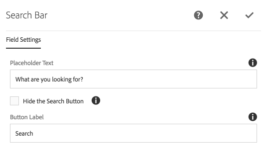

The Search Bar render a full-text search bar allowing users to enter search terms of phrases.

As this component passes through its input to AEM's Query Builder Fulltext predicate evaluator, it supports all the native lucene operators that AEM/Apache Oak supports.


## Authoring

The Search Bar component supports minor authoring of text and labels.

### Dialog / Field Settings
 
 
 
#### Placeholder Text

Text to display as the placeholder text for the search bar input field.
    
#### Hide the Search Button

Select to hide the search button.

 * _Even when the search button is hidden, a search can be performed by pressing enter in the search field._
 
#### Button Label

The label to display on the Search Bar's button.

  * Pressing this button will execute a search.
  * When the **Hide the Search Button** is selected, this button/button label is not displayed. 
                    
## Technical details

* **Component**: `/apps/asset-share-commons/components/search/statistics`
* **Sling Model**: `com.adobe.aem.commons.assetshare.search.predicates.impl.FulltextPredicateImpl`

The search bar leverages AEM Query Builder's [FulltextPredicateEvaluator](https://docs.adobe.com/content/docs/en/aem/6-3/develop/ref/javadoc/com/day/cq/search/eval/FulltextPredicateEvaluator.html) predicate evaluator. 

Example generated Query Builder date range predicate output: 

```
fulltext=ira OR bear
```