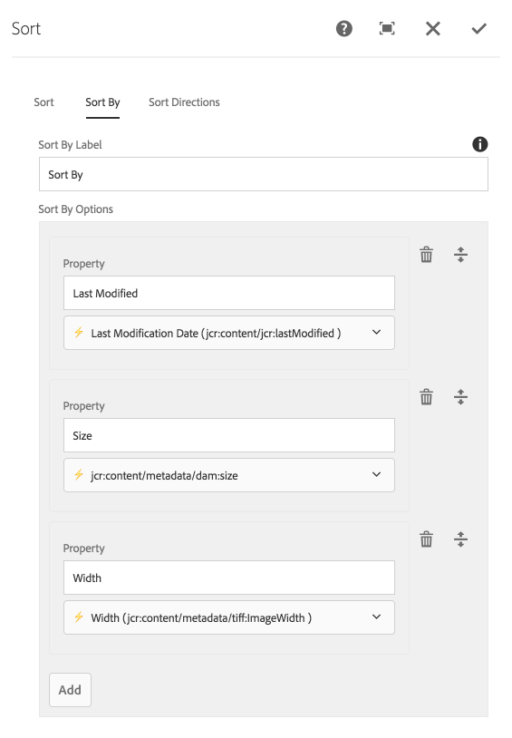
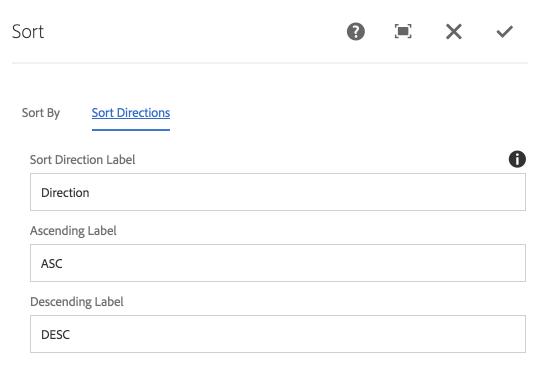
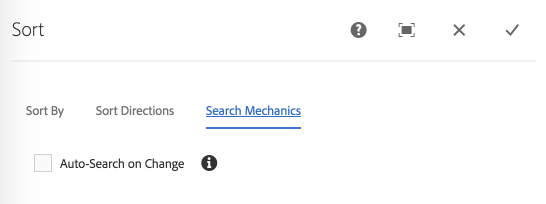

---
title: Sort
layout: component-page
tags: search,component
last-updated-version: 1.6.4
--- 


The Sort component exposes Sorting controls the user can sort the results with. 
Only one sort may be applied at a time. For example, this component does NOT support sorting by Last Modified and then Title.

> Note that the initial sort is not reflected in the sort component, as initial sort is set on the [Results component](../results).

## Authoring

Authors may specify all ordering options.

### Dialog / Sort By tab 
 
 

#### Sort By Options

An order-able list of properties that can be sorted by.

* Label: The text displayed in the selection.
* Property: A drop-down of eligible properties for sorting. 
    * See Technical details below for information on how this list is populated. 
                    
### Dialog / Sort Directions tab             



#### Ascending Label

The text to display for the "Ascending" sort option.

#### Descending Label

The text to display for the "Descending" sort option.


### Dialog / Sort Mechanics tab

 

#### Auto-Search on Change (v1.3.0)

Select to automatically perform a search whenever the end-user selected filter criteria of this component changes.


## Technical details

* **Component**: `/apps/asset-share-commons/components/search/sort`
* **Sling Models**: `com.adobe.aem.commons.assetshare.search.predicates.impl.SortPredicateImpl`, `com.adobe.aem.commons.assetshare.search.predicates.impl.PagePredicateImpl`
    
    
The Sort component leverages AEM Query Builder's [PredicateEvaluator's](https://docs.adobe.com/content/docs/en/aem/6-3/develop/ref/javadoc/com/day/cq/search/eval/PredicateEvaluator.html) ordering functionality.
Example generated Query Builder orderby predicate output: 

```
orderby=@jcr:content/jcr:lastModified
orderby.sort=desc
```

### Initial values

v1.6.4 introduces ability for the Sort component to inspect the Search Results component to display true initial values (vs generic labels).
This means the Sort component should have a Sort By entry that matches the Search Result component's default Sort By property.

If the Search Result's Default Sort By property does not have an match in the Sort component, the string "Unknown" will be displayed.

### Sorting property candidates

The properties available for sorting (and including the psuedo property `@jcr:score`), are determined by inspecting the `/oak:index/damAssetLucene` index and collecting all properties marked with `orderable=true`.

Since ordering on unoptimized properties can be extremely slow, only these optimized properties are eligible candidates. 

If other properties are required for sorting, see your IT team about augmenting the `/oak:index/damAssetLucene` index to ensure they are marked with `orderable=true`.