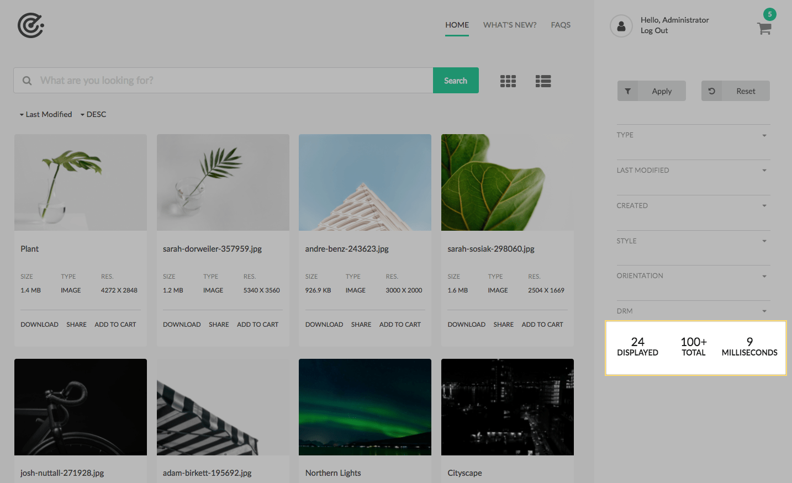
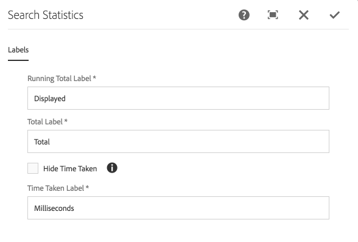

The Search Statistics component displays information about the current search state:

* The number of results displayed on the page.
* The total number of results (this is often in the format ###+ due to the use of QueryBuilder's guessTotal functionality).
* The time taken to execute the last query.
    * Note that this its not a running summation, but the time taken for the last search. This could be a full search, or a load more.

## Authoring

### Dialog / Labels
 
 
 
#### Running Total Label

The text for "running total" count.
    
#### Total Label

The text for "total results" count.
    
#### Hide Time Taken

Select to hide the "time taken" statistic.
    
#### Time Taken Label

The text for "time taken" (in milliseconds).

  * This does not display when **Hide Time Taken** is selected.
                   
## Technical details

* **Component**: `/apps/asset-share-commons/components/search/statistics`
* **Sling Model**: `N/A`
