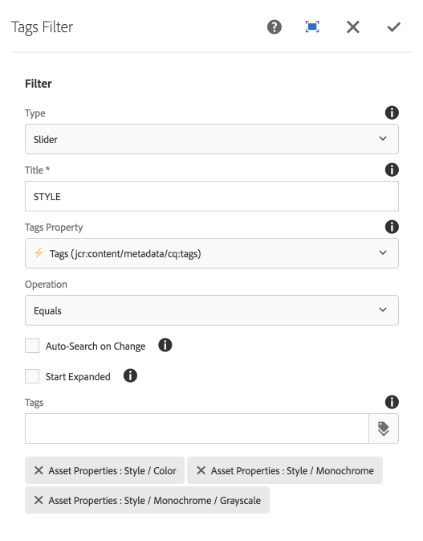

The Tags Filter component displays controls that allow an end-user to refine search's based on AEM Tags assigned to the assets.

Note this component only matches on exact tags and does NOT match on descendant tags.

## Authoring

### Dialog / Filter
 
 
 
#### Type

The form controls to display for this filter.

  * Checkboxes _(Multi select)_
  * Radio buttons _(Single select)_
  * Slider _(Single select)_
  * Toggle _(Single select)_

#### Title

Label for the filter.

#### Metadata Property

List of Asset metadata properties available for filtering.

  * Labels/Properties are derived from available Metadata Schemas
  * Lightning icon (⚡) indicates this property is optimized for search.
  * Turtle icon (🐢) indicates this property is optimized for search.
  
#### Operation

The search operation to perform between the Metadata Property and Option(s).
 
  * **Equals**
      * Metadata property exactly matches value
  * **Does not equals**
      * Metadata property does not matches value

#### Start Expanded      
  
Select to initially render the component filter in an expanded mode, showing the selection options.

#### Tags

Defines the tags that can be filtered against.
        
## Technical details

* **Component**: `/apps/asset-share-commons/components/search/tags`
* **Sling Model**: `com.adobe.aem.commons.assetshare.search.predicates.impl.TagsPredicateImpl`

This filter implements a wrapped version of AEM Query Builder's [JcrPropertyPredicateEvaluator](https://docs.adobe.com/docs/en/aem/6-3/develop/ref/javadoc/com/day/cq/search/eval/JcrPropertyPredicateEvaluator.html). 
The Asset Share Commons' provided predicate wrapper (`com.adobe.aem.commons.assetshare.search.impl.predicateevaluators.PropertyValuesPredicateEvaluator`) allows for the values to be provided as comma-delimited values to be transformed into `#_value` parameters for evaluation by AEM's JcrPropertyPredicateEvaluator; 

Example generated Query Builder predicate output: 

```
1_group.propertyvalues.property=./jcr:content/metadata/cq:tags
1_group.propertyvalues.operation=equals
1_group.propertyvalues.1_values=we-retail:activity/surfing
1_group.propertyvalues.2_values=we-retail:activity/swimming
```      


