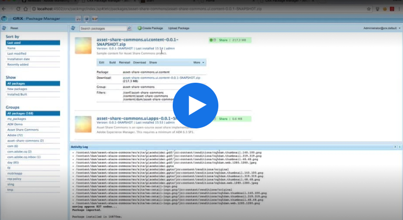

## Pre-requisites

* [AEM 6.3 Service Pack 1 on AEM Package Share](https://docs.adobe.com/docs/en/aem/6-3/release-notes/sp1.html)
* [ACS AEM Commons 3.11.0+](https://github.com/Adobe-Consulting-Services/acs-aem-commons/releases)
    * _Generally optional, but required for E-mail Sharing._ 

## Asset Share Commons Downloads

* [https://github.com/Adobe-Marketing-Cloud/asset-share-commons/releases](https://github.com/Adobe-Marketing-Cloud/asset-share-commons/releases)

Download the latest available versions of the **ui.apps** and **ui.content** packages.

## Set Up Video

Video walk-through of Asset Share Commons hosted on helpx.adobe.com.

 

