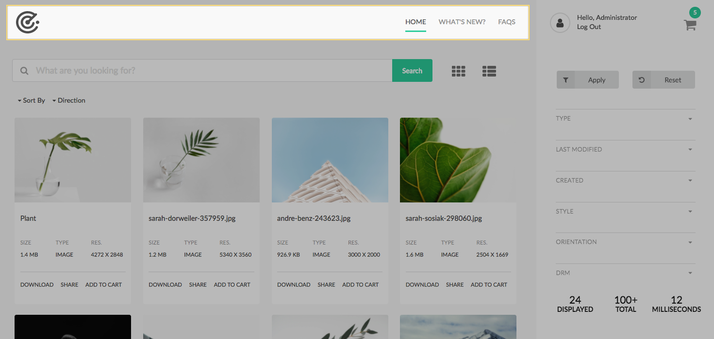
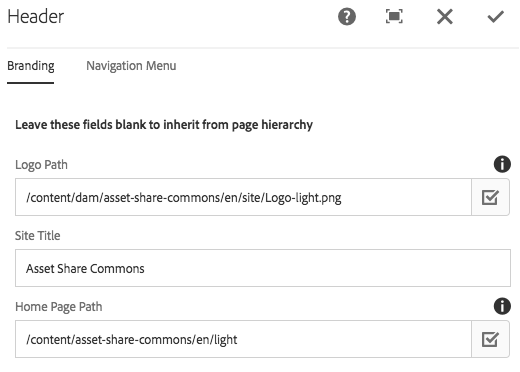
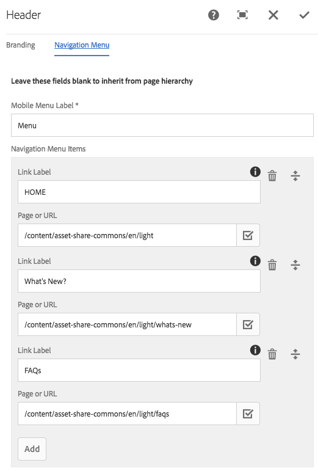

The Header component displays a logo and a single level navigation. The header component is optimized for tabet and mobie devices.

## Template Authoring

The header component should only be included via an editable template. It is not inteded to be added directly to a Page (`cq:Page`). 
The header component is unlocked in the Search Page Template allowing authors to update the Navigation links. 
Detail and Content templates include the header in a locked state.

### Policy Dialog


#### Relative Header Component Path

A path relative to the Page's `jcr:content` node that identifies the expected location of the header component. This is used by child pages to inherit the Header of a parent page. 

#### Logo Path

A path to a image to be used as the logo for the header. Will be overridden if a logo is configured within a Page.

#### Site Title

Text to display next to the logo as the site's title. Will be overridden if configured within a page.

## Page Authoring

### Content Hierarchy

The content hierarchy is expected to have a Search Page as the "Home" or root of the site. The Search Page Template is the only template in which the Header component is unlocked and editable by content authors. All pages created beneath the Search Page will inherit the header component configuration.

```
/content
  /<site-name> 
    /<language-root>
      /<search-page>              (Header/Navigation configured here)
        /<details-page>           (inherits header)
           /<image-details-page>  (inherits header)
           /<video-details-page>  (inherits header)
        /<sub-search-page>        (inherits header)
        /<content-page>           (inherits header)
```

### Dialog / Branding



#### Logo Path

A path to a image to be used as the logo for the header. Takes precedence if a logo is configured by the template.

#### Site Title

Text to display next to the logo as the site's title. Takes precedence over policy Site Title.

### Dialog / Navigation Menu



#### Mobile Menu Label

(Required) Label to display for the drop down when the menu shrinks in mobile viewports.

#### Navigation Menu Items

Multi field to populate the navigation items.

* **Link Label** - Text to display in navigation. Leave blank to use the Page title of the selected page.
* **Page or URL** - A path to a cq:Page or an absolute URL.

## Technical details

* **Component**: `/apps/asset-share-commons/components/structure/header`
* **Sling Models**: `com.adobe.aem.commons.assetshare.components.structure.impl.HeaderImpl` and `com.adobe.aem.commons.assetshare.components.structure.impl.NavigationItemImpl`

In mobile and tablet view the rail collapses and a hamburger icon is displayed. Clicking this expands the rail. The javascript for this behavior is in the User Menu component `/apps/asset-share-commons/components/structure/user-menu`.