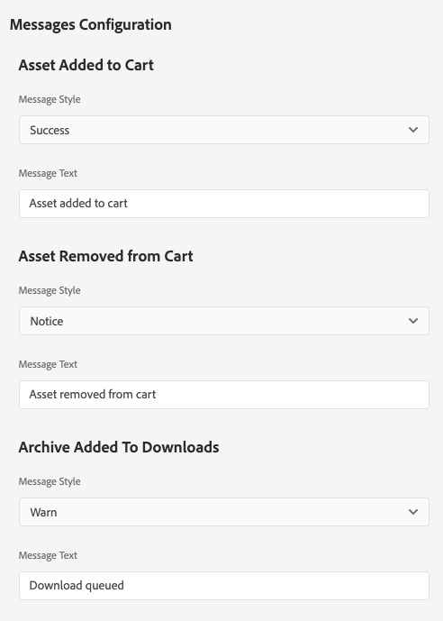
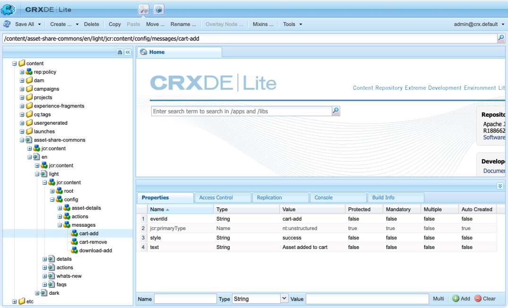

The Messages component displays a notification to a user about an action taken. 

Currently messages are only used to notify a user when:

* An asset is added to the cart
* An asset already exists in their cart
* When an asset has been added to the downloads list (AEM as a Cloud Service 2.0+)

If no text is associated with a message, then no message is displayed.

## Authoring

There is no authoring directly on the Messages component. The messages for adding/exists in cart are configured via the Search Page properties.


### Dialog / Page Properties section on Search Page's Asset Share tab




#### Message Style

The color/style to display the message as
* Success
* Notice
* Warn
* Error

#### Message Text

The text to display on the notification

More details can be found on the [Search Page](../../search) documentation.

## Technical details

* **Component**: `/apps/asset-share-commons/components/structure/messages`
* **Sling Models**: `com.adobe.aem.commons.assetshare.configuration.impl.MessagesImpl`
* **JavaScript**: `/apps/asset-share-commons/clientlibs/clientlib-site/js/messages.js`


Messages are stored under the search page in the following node structure:



```
/content/.../<search page>/jcr:content/config/messages
    <message-1>
        eventId: the unique Id used to reference this message via JavaScript (see below)
        style: the style (color) to display the message with  (success, notice, warn, error)
        text: the text to display in the message
```

If a new message node structure is added under the messages node, it will be automatically made available on the asset share pages under that search page.

Once a message is defined, it can be invoked via JavaScript using the following code:

```
    AssetShare.Messages..show(<eventId>);
    
    /// ... so to show the card-add, this might look like:

    AssetShare.Messages.show('cart-add');

```
