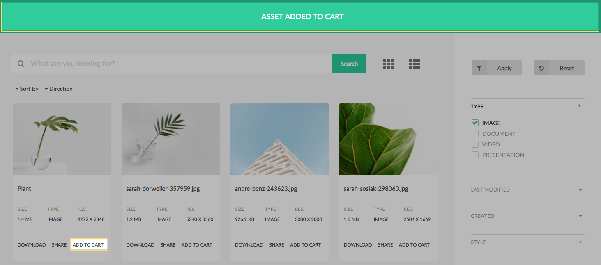
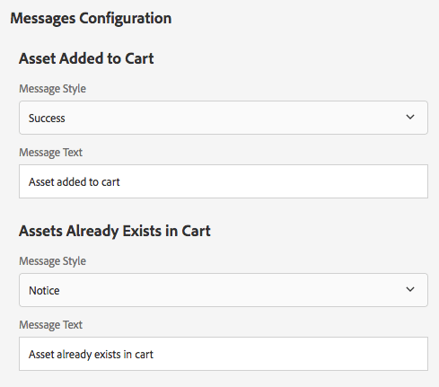

The Messages component displays a notification to a user about an action taken. 

Currently messages are only used to notify a user when:

* An asset is added to the cart
* Or already exists in their cart

## Authoring

There is no authoring directly on the Messages component. The messages for adding/exists in cart are configured via the Search Page properties.

More details can be found on the [Search Page](../../search) documentation.

## Technical details

* **Component**: `/apps/asset-share-commons/components/structure/messages`
* **Sling Models**: `com.adobe.aem.commons.assetshare.configuration.impl.MessagesImpl`
* **JavaScript**: `/apps/asset-share-commons/clientlibs/clientlib-site/js/messages.js`