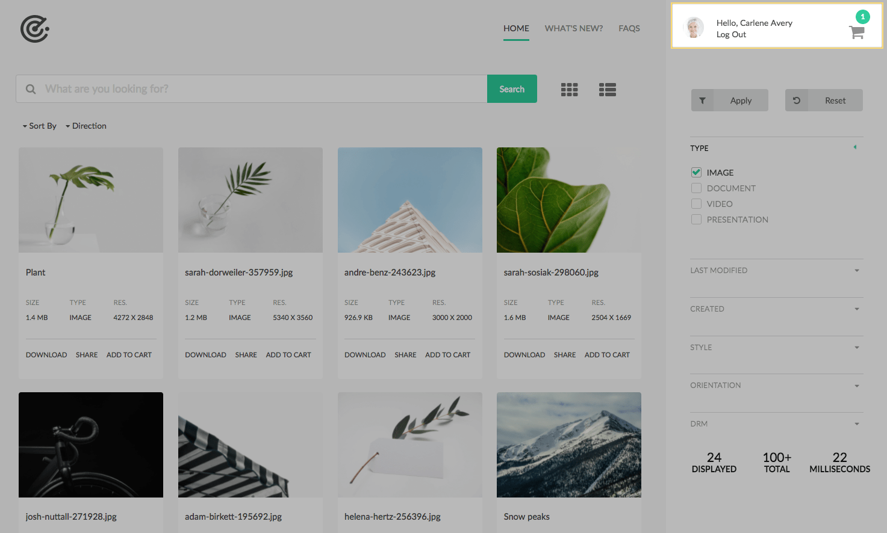
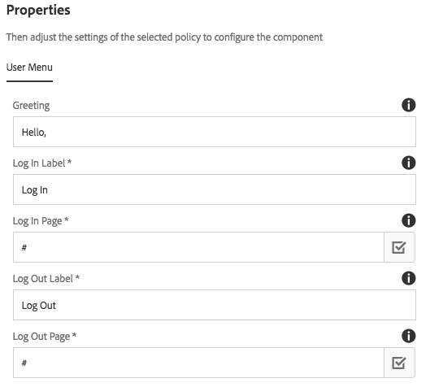

* *Only to be added via an editable template. Not intended to be added directly to a content page.*

The User Menu component displays two items:
 
* The currently logged in user.
* Displays a cart indicating the number of assets a user has added to his/her cart. 

In mobile/tablet breakpoints the rail disappears. When the rail is opened via the Header component a close icon appears that allows a user to close the rail.

## Template Authoring

The User Menu component should only be included via an editable template. It is not inteded to be added directly to a cq:Page. The User Menu component should always be in a locked state and only configurable via a template.

### Policy Dialog / User Menu

#### Greeting

Text to display in front of the user name. 

#### Log In Label

Text to populate the Log In link.

#### Log In Page

Path to a cq:Page or URL for log in.

#### Log Out Label

Text to populate the Log Out link.

#### Log Out Page

Path to a cq:Page or URL to log out.

## Technical details

* **Component**: `/apps/asset-share-commons/components/structure/user-menu`
* **Sling Models**: `com.adobe.aem.commons.assetshare.components.structure.impl.HeaderImpl`, `com.adobe.aem.commons.assetshare.components.structure.impl.UserMenuImpl`

In mobile and tablet view the rail collapses and a hamburger icon is displayed in the Header component. 
Clicking the hamburger icon expands the rail. In mobile/tablet view a close icon is displayed in the user menu, allowing a user to close the rail. 
The JavaScript and CSS to toggle the rail is included in the User Menu's clientlibs.

The User Menu will attempt to display the currently logged-in User's profile picture. If none can be found a user icon is displayed.

### Cache Considerations

If caching pages for an authenticated user there is a potential issue in that User Menu component could be saved to the HTML cache. A feature like [Sling Dynamic Include](https://helpx.adobe.com/experience-manager/kt/platform-repository/using/sling-dynamic-include-technical-video-setup.html) should be used for the above use case.